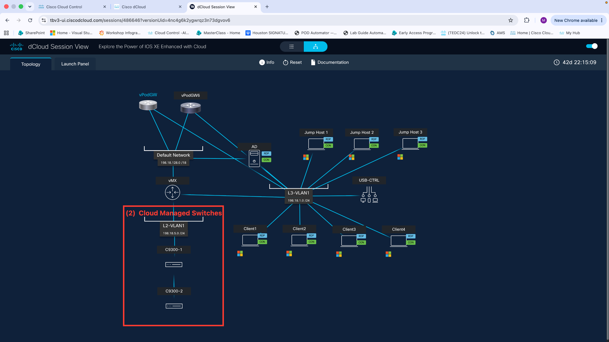

# Explore the LAB and Cloud Control Capabilities

In this section, you will discover how Cloud Control streamlines the management of your cloud infrastructure through a centralized interface. You'll gain hands-on experience with its core monitoring, automation, and governance features to understand how they work together to simplify operations at scale.

## Step 1: Lab and Topoloy  Overview

Review the assigned lab POD and network topology diagram provided in your lab guide. Note your POD number, device hostnames, IP addressing scheme, and the interconnections between devices, as these will be referenced throughout this lab.

!!! success "Expected Result"
    
Your POD's network topology is understood. Each POD has two (2) dedicated 9300 Cloud Managed switches and multiple attached clients, providing a small but real-world branch site to work with.

## Step 2: Logging into your assinged Cloud Control Tenant and exploring the Home Screen

Open a web browser and navigate to <a href="https://cloud.cisco.com" rel="noopener noreferrer" target="_blank"><strong>https://cloud.cisco.com</strong></a>. Enter your provided credentials (username and password) and click <strong>Sign In</strong> to authenticate. Accept any authentication pop-ups.

<strong>NOTE:</strong> If you are unable to locate your POD login credentials, please contact a proctor.

!!! success "Expected Result"
    
You are successfully logged in to the Cloud Control tenant dashboard and have explored the home screen.

## Step 3: Explore 9-Dot Menu

Click&nbsp;the&nbsp;<strong>9-dot&nbsp;menu</strong>&nbsp;(grid&nbsp;icon)&nbsp;located&nbsp;in&nbsp;the&nbsp;top&nbsp;navigation&nbsp;bar&nbsp;of&nbsp;Cloud&nbsp;Control&nbsp;to&nbsp;explore&nbsp;the&nbsp;available&nbsp;options&nbsp;and&nbsp;applications.&nbsp;

!!! success "Expected Result"
    
The 9-dot menu expands to display all available applications and navigation options within Cloud Control. You have explored the applications, products, and the option to pin items to the navigation banner.

