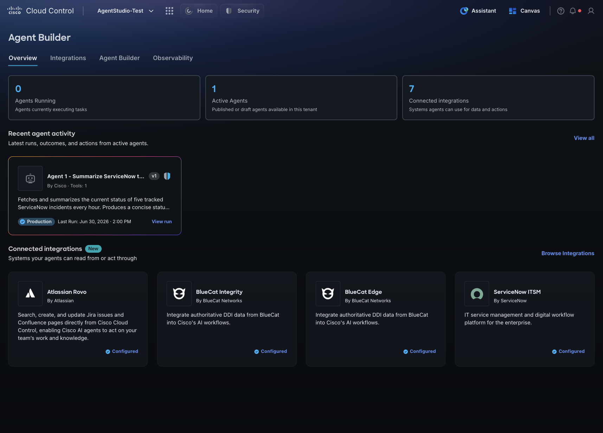
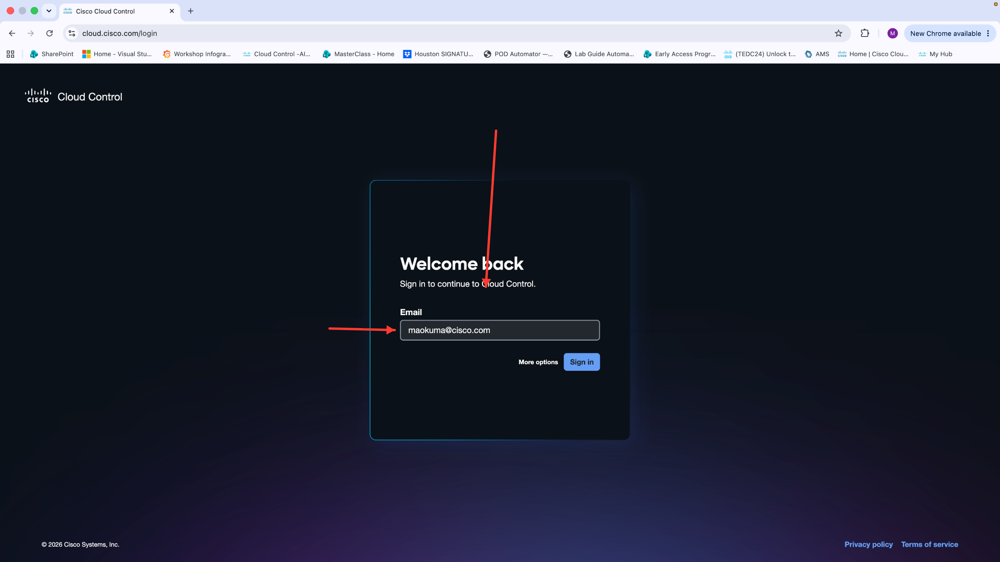

# Navigating to Agent Builder

## Step 9: Overview

Log in to Cloud Control at cloud.cisco.com.

Click the nine-dots menu in the top header.

Under Platform Services, click Studio. If it is not visible, click Show more to expand the list.

This opens the Agent Builder Overview page. The top navigation bar has four tabs: Overview, Integrations, Agent Builder, and Observability.

On a fresh setup, the Overview page shows two calls to action: Browse Integrations and Create an Agent. It also shows three summary cards — agents currently running, total active agents, and number of connected integrations — along with a Recent Agent Activity section and a Connected Integrations section.

