# Section 1: Explore the LAB and Cloud Control Capabilities

In this section, you will discover how Cloud Control streamlines the management of your cloud infrastructure through a centralized interface. You'll gain hands-on experience with its core monitoring, automation, and governance features to understand how they work together to simplify operations at scale.

## Step 1: Lab and Topoloy  Overview

Review the assigned lab POD and network topology diagram provided in your lab guide. Note your POD number, device hostnames, IP addressing scheme, and the interconnections between devices, as these will be referenced throughout this lab.

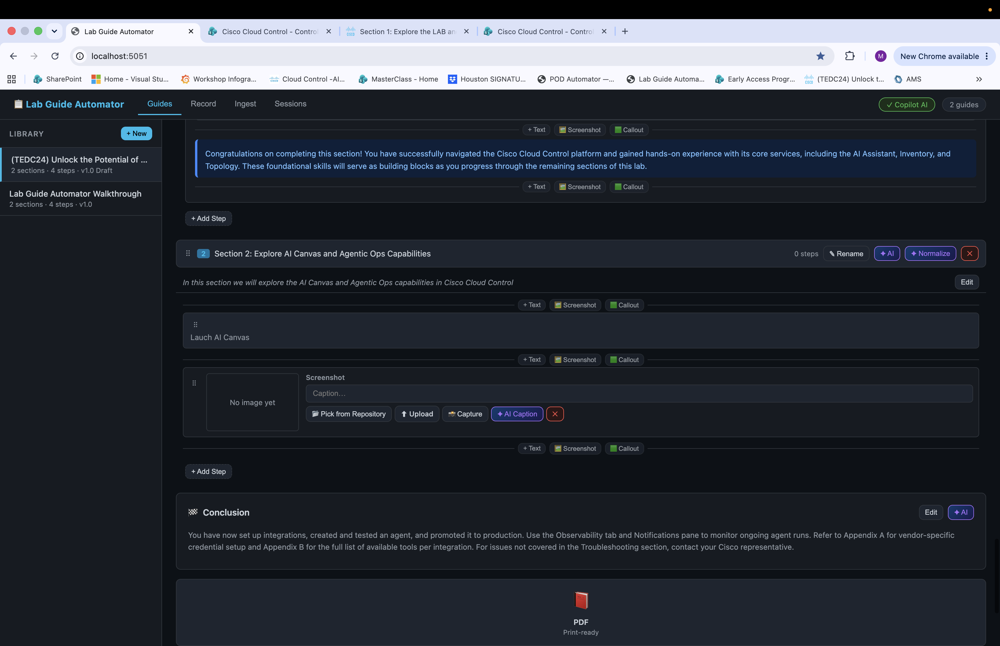

## Step 2: Logging into your assinged Cloud Control Tenant and exploring the Home Screen

Open a web browser and navigate to [**https://cloud.cisco.com**](https://cloud.cisco.com). Enter your provided credentials (username and password) and click **Sign In** to authenticate. Accept any authentication pop-ups.

**NOTE:** If you are unable to locate your POD login credentials, please contact a proctor.

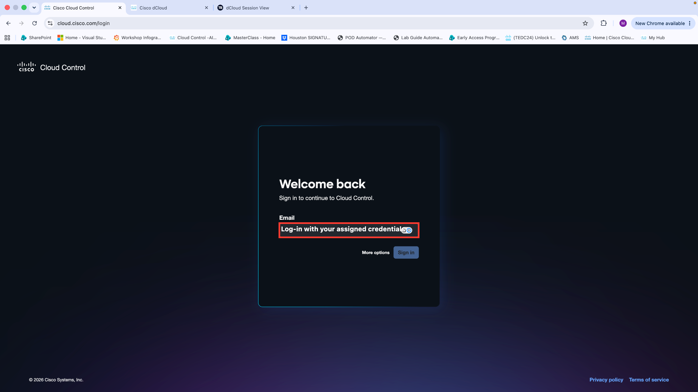

After logging in, explore the three sections on the home screen.

1. **Selected Organization** — If you have access to more than one organization, use this section to switch between them.

2. **AI Assistant** — Use this natural language interface to interact with the platform. Explore the pre-built prompts and run sample queries. Note that data is limited in this lab environment and results may differ from a production deployment.

3. **Actions** — Review any actions required in your environment. Take note of what is displayed. These actions can be engaged agentically, which will be covered in detail later in this lab.

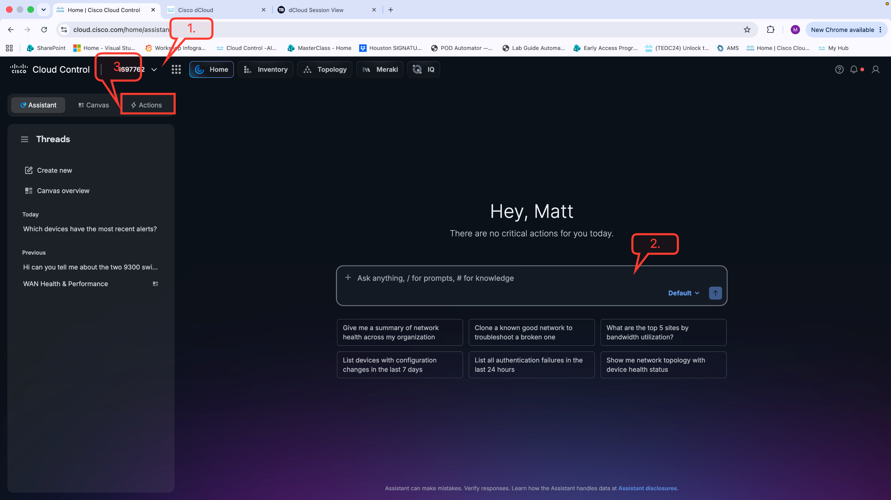

## Step 3: Explore 9-Dot Menu

Click the **9-dot menu** (grid icon) located in the top navigation bar of Cloud Control to explore the available options and applications.

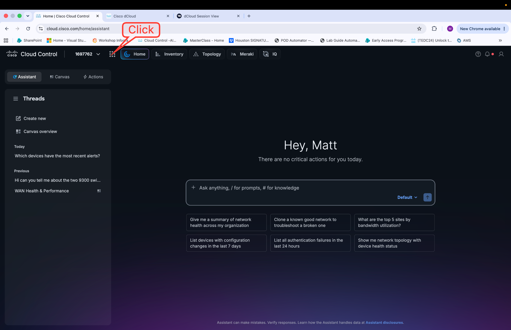

Explore the three main sections available on the platform.

1. **Platform Services** — These services span the entire infrastructure. Each will be explored in detail throughout this lab. Additional services, such as Fabric, will continue to be added over time.

2. **Products** — These are the products currently integrated with your tenant. In this lab, only Meraki is integrated. In a production environment, multiple products would typically be present. For a full list of supported products and onboarding requirements, visit the [Cloud Control Onboarding SharePoint site](https://cisco.sharepoint.com/sites/CiscoCloudControl-ControlledAvailability/SitePages/Home.aspx).

3. **Favorites** — Save frequently visited pages from any product in this section for quick access during future sessions.

!!! note ""
    Click a Platform Service or Product to pin it to the navigation bar. This bar remains visible throughout Cloud Control, enabling quick and consistent access regardless of where you navigate.

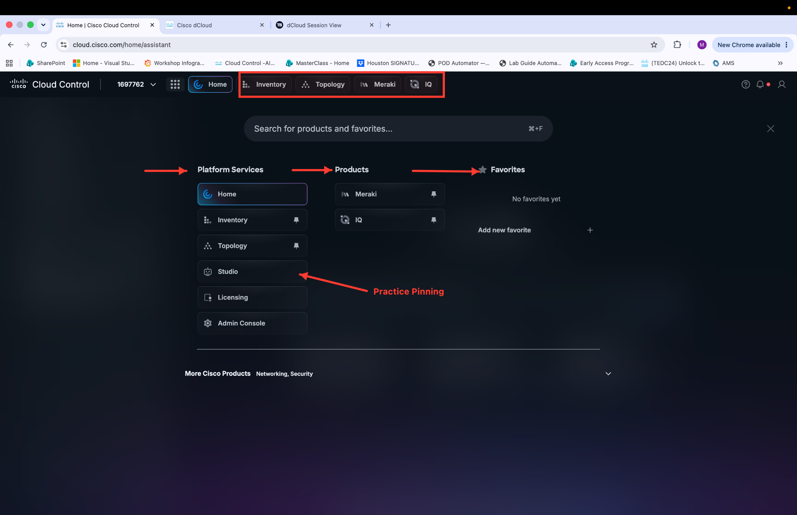

## Step 4: Explore Inventory Capabilities

Navigate to the **Inventory** section of Cisco Cloud Control to explore the available inventory capabilities.

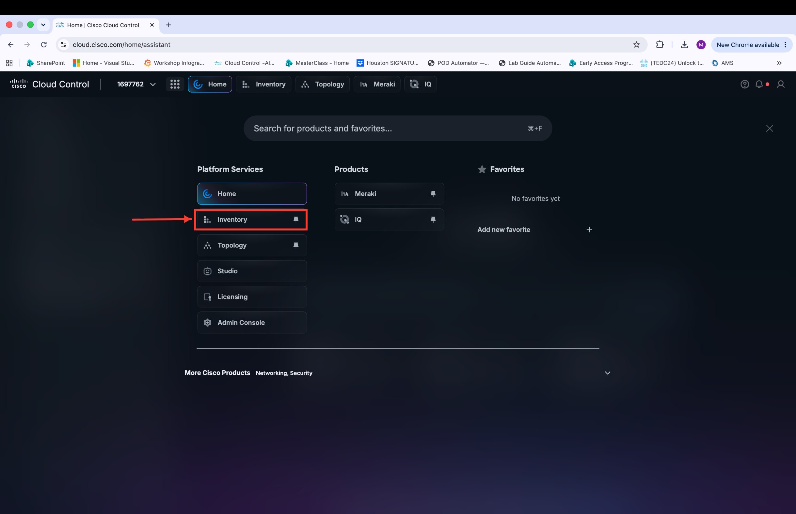

Next, explore the available capabilities. Review the Inventory Insights dashboard to examine detected issues, recommendations, and asset visibility across your managed devices.

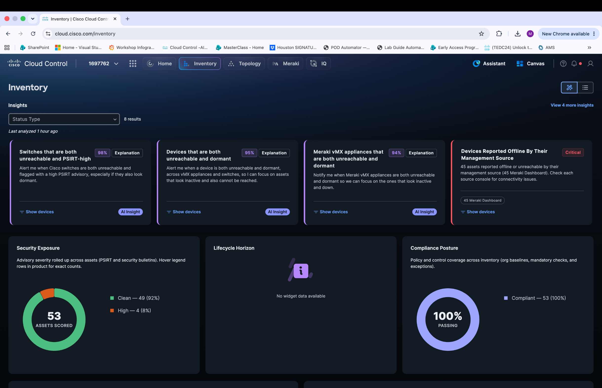

Click **Show Device Inventory** or select an alternative view to change the display format.

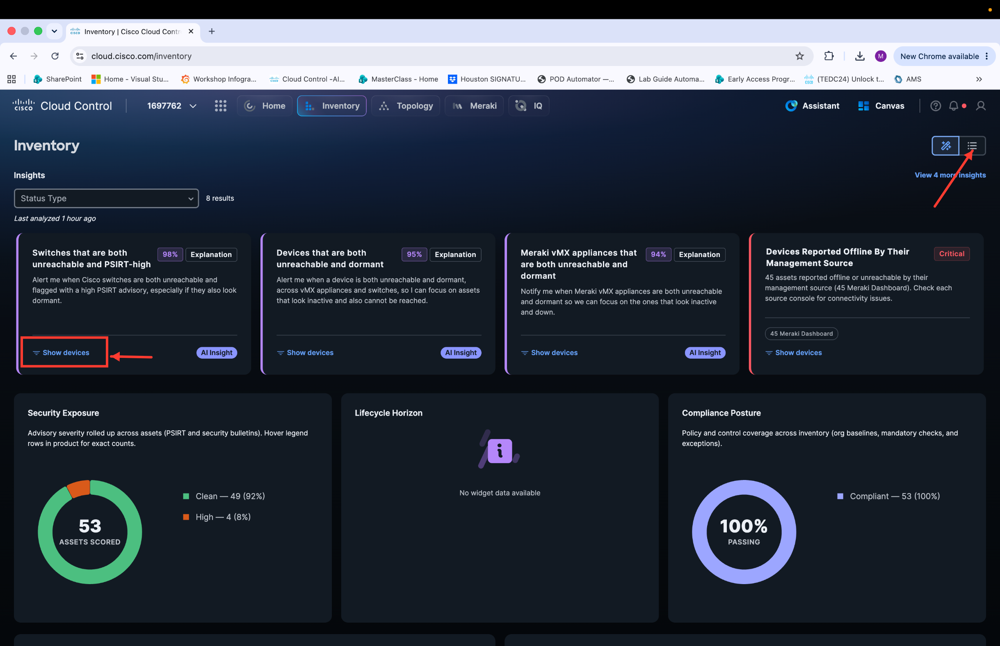

Practice using the AI-assisted search functionality within the Inventory section. Collaborate with your team to explore the available Inventory capabilities, including filtering, sorting, and device categorization options.

Locate your two dedicated switches within the Inventory list and click one to select it.

Observe the device details panel that opens on the right side of the screen. This panel displays comprehensive information for your **C9300-X-X** Cisco Catalyst C9300 switch.

Review the **General** tab, which provides a high-level device overview including key operational indicators. Confirm that the Reachability status shows *Reachable*, indicating the device is actively communicating with the management platform, and that the Compliance status shows *Compliant*, confirming the device configuration meets your organization's defined policy standards.

After reviewing the device details, click the **View in Meraki** button in the bottom-right corner of the details panel.

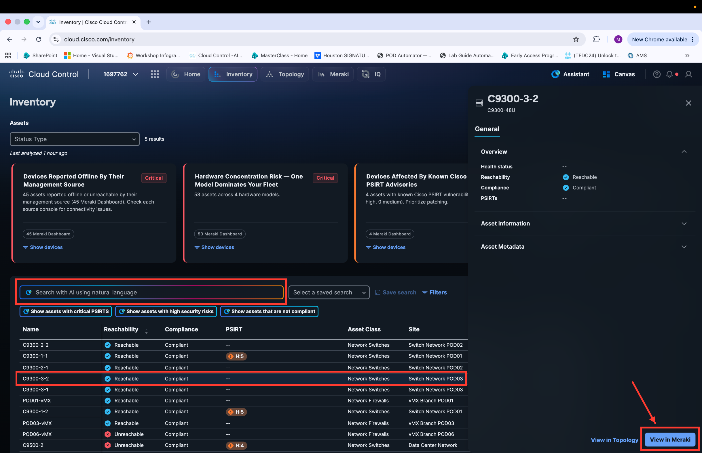

This action opens the Meraki Dashboard in context for the selected device, demonstrating the seamless cross-platform navigation capability within Cisco Cloud Control.

This integration allows network administrators to move fluidly between unified inventory management and platform-specific dashboards without separately logging in or searching for the device within Meraki.

Notice the top navigation bar, which reflects the unified Cloud Control interface. Click **Home** to return to the Cloud Control home screen, or click any other element in the banner to navigate directly to it. These tabs allow you to seamlessly move between management planes within a single dashboard.

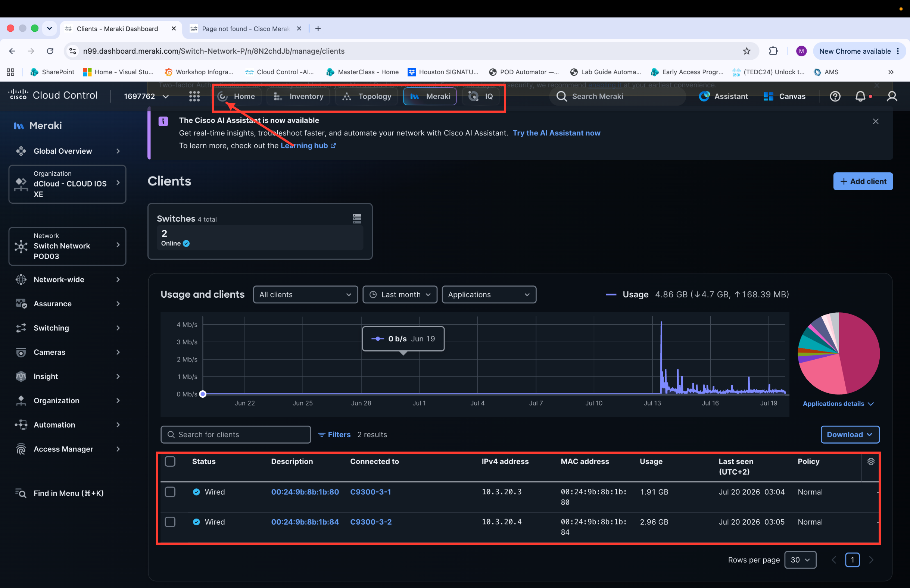

From the top navigation banner, click **Topology**.

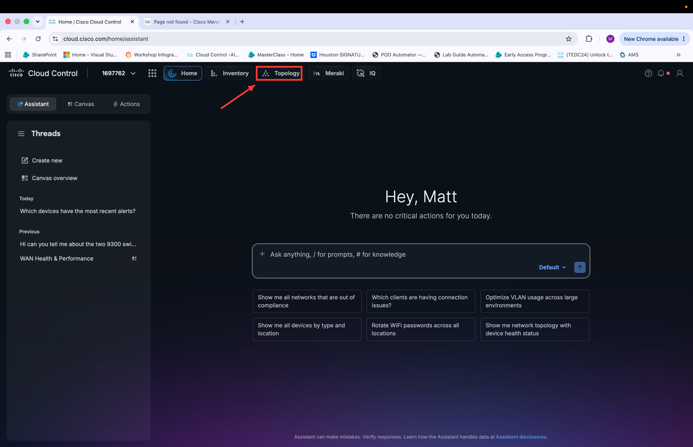

The Topology view displays your global network topology organized by site, providing a visual representation of device relationships and connectivity across your environment.

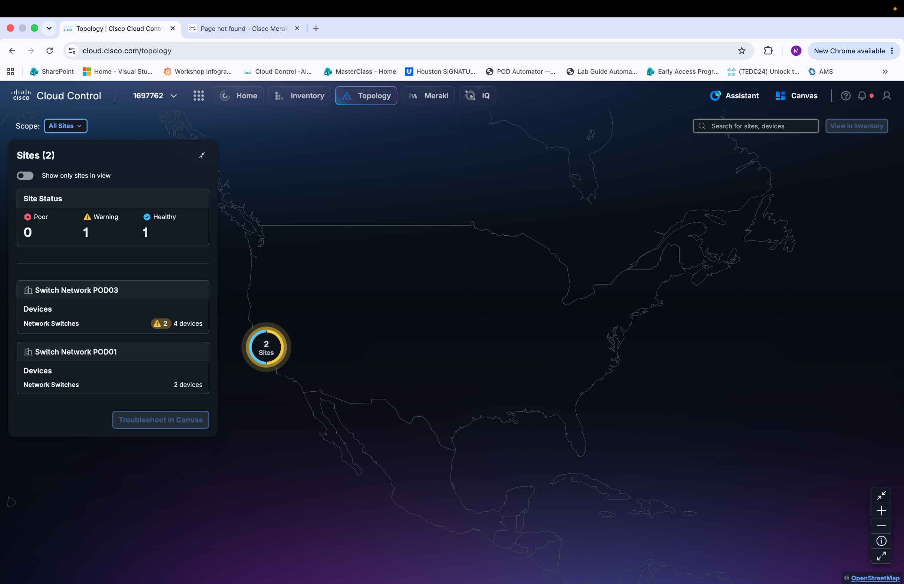

!!! note ""
    Congratulations on completing this section! You have successfully navigated the Cisco Cloud Control platform and gained hands-on experience with its core services, including the AI Assistant, Inventory, and Topology. These foundational skills will serve as building blocks as you progress through the remaining sections of this lab.
