# Section 1: Explore the LAB and Cloud Control Capabilities

In this section, you will discover how Cloud Control streamlines the management of your cloud infrastructure through a centralized interface. You'll gain hands-on experience with its core monitoring, automation, and governance features to understand how they work together to simplify operations at scale.

## Step 1: Lab and Topoloy  Overview


!!! info "Note"
    This lab is based on the dCloud **"Cisco Cloud Control: AgenticOps in Action"** experience. Your assigned login has been provisioned with elevated permissions that unlock advanced capabilities beyond the standard dCloud environment — most notably **Agent Studio**, which is the primary focus of this lab.

    These special permissions allow you to build, test, and deploy agentic workflows across the Cisco Cloud Control platform in ways that reflect real-world production use cases. Throughout this lab, you will move from exploration to hands-on creation, gaining practical experience with the tools and services that power Cisco's Agentic Operations framework.

## Lab Topology

Your lab environment is pre-integrated with a broad set of Cisco platforms and third-party services. The topology reflects a realistic enterprise deployment, giving you visibility and control across networking, security, cloud, and collaboration domains.

The following products and controllers are available in your environment:

- **Cisco Security Cloud Control** — The unified management plane that ties all security services together. This is your primary interface throughout the lab.

- **AI Defense** — Provides AI-powered threat detection and policy enforcement across your environment.

- **Multicloud Defense** — Delivers consistent security policy and visibility across multiple cloud providers.

- **Secure Access** — A cloud-delivered SSE solution combining ZTNA, SWG, CASB, and DNS security.

- **Secure Firewall** — Next-generation firewall capabilities managed through the unified control plane.

- **Secure Workload** — Provides workload segmentation, micro-segmentation policy, and application dependency mapping.

- **Cisco Meraki** — Cloud-managed networking including switching, wireless, and SD-WAN, integrated directly into Cloud Control.

- **Cisco Intersight** — Unified infrastructure management for compute, storage, and HCI across on-premises and cloud.

- **Cisco Nexus Dashboard** — Centralized operations hub for data center networking, providing analytics, orchestration, and insights.

- **Nexus Hyperfabric** — A cloud-managed, AI-driven data center fabric solution for simplified network operations.

- **Cisco Collaboration Control Hub** *(formerly Webex Control Hub)* — The administration portal for managing Webex collaboration services, users, and devices at scale.

Not all products listed above will be actively used in every section of this lab. However, their presence in the topology reflects the breadth of the Cisco Cloud Control platform and the scope of what agentic workflows can reach and act upon.

!!! warning "Caution"
    You have been granted elevated permissions necessary to complete the exercises in this lab. With these additional privileges comes an expectation of responsible use. Please confine your activities strictly to the tasks and resources outlined in this lab guide. Unauthorized actions — such as modifying shared infrastructure, accessing resources outside the scope of this lab, or interfering with other participants' environments — can disrupt the experience for everyone. Any actions you take may be logged and audited. Please be a good steward of the shared environment.

---

## Step 2: Logging into with your assigned Cloud Control user and exploring the Home Screen

Open a web browser and navigate to the lab landing page at: [http://cs.co/TEDC24](https://dcloud2-rtp.cisco.com/content/instantdemo/cisco-cloud-control-for-ai-canvas-team?returnPathTitleKey=content-view) . Then **Click** View.

---

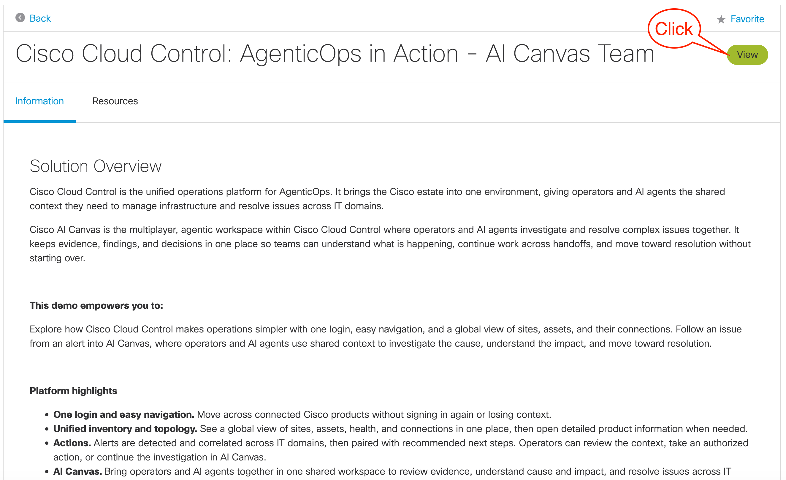

---

Next, **Click** on your assigned **user credentials **and click **Sign In** to authenticate and login.

---

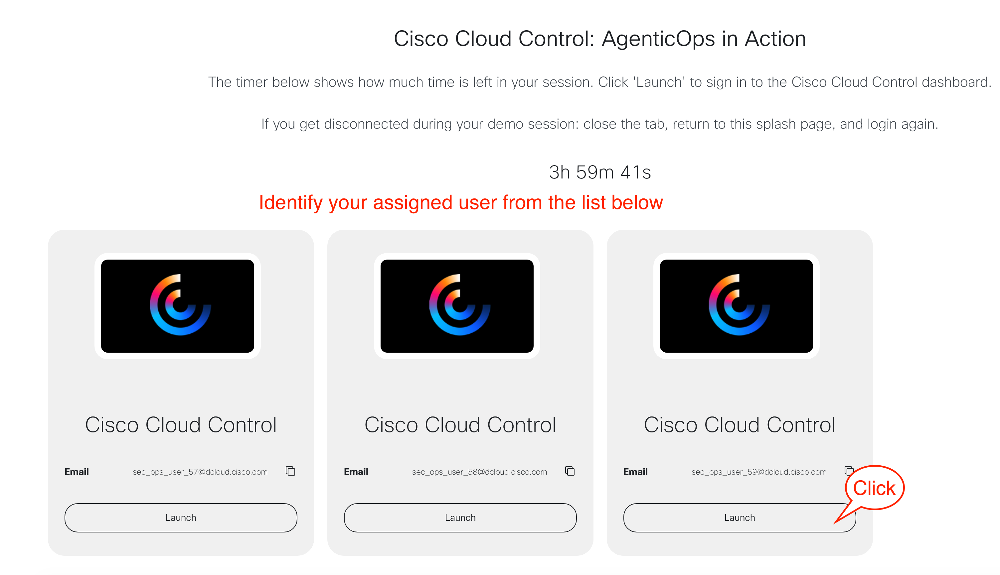

---

!!! info "Note"
    If you are unable to locate your POD login credentials, please contact a proctor. Please use caution and verify you are logging into your assigned POD, as this will ensure a successful lab experience for all.

After logging in, explore the three sections on the home screen.

1. **Selected Organization** — If you have access to more than one organization, use this section to switch between them.

2. **AI Assistant** — Use this natural language interface to interact with the platform. Explore the pre-built prompts and run sample queries. Note that data is limited in this lab environment and results may differ from a production deployment.

3. **Actions** — Review any actions required in your environment. Take note of what is displayed. These actions can be engaged agentically, which will be covered in detail later in this lab.

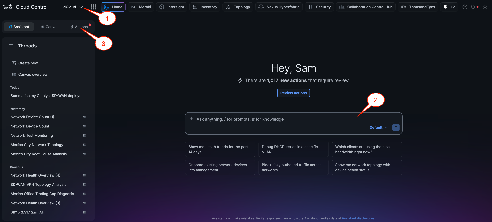

Next, navigate to [**Appendix A: Sample AI Prompts**](../appendix-a-sample-ai-prompts/) and spend time running the validated prompts for this environment. Use the **copy button** on each prompt block to paste directly into the AI Assistant or Agentic Canvas — this ensures accuracy and eliminates the risk of transcription errors. As you work through each prompt, observe how the system interprets the input, what format the response takes, and how quickly results are returned.

The goal of this exercise is to thoroughly prepare yourself for live customer demonstrations by building familiarity and confidence with a core set of prompts that consistently produce clear, accurate, and compelling results. Consider the following as you explore:

- **Identify your strongest examples.** Some prompts will generate output that is particularly well-suited for showcasing the capabilities of the environment. Take note of these and prioritize them for use in demos.

- **Understand the output.** Be prepared to explain to a customer not just what the output shows, but why it is useful and how it maps to a real-world business scenario or use case.

- **Anticipate follow-up questions.** As you review each result, think about questions a customer might ask and ensure you can speak confidently to the underlying functionality.

- **Practice your delivery.** Running through these prompts multiple times will help you develop a smooth, natural delivery so that the demonstration feels polished and professional rather than scripted.

Take as much time as needed during this section to become comfortable with the material. A well-rehearsed demonstration using familiar prompts is far more effective than presenting new or untested examples under the pressure of a live customer engagement.

**Example prompts you can use:**

!!! tip "Tip"
    You can access [**Appendix A: Sample AI Prompts**](../appendix-a-sample-ai-prompts/) at any time from the navigation menu on the left. Each prompt has a copy button — click it to copy the prompt instantly to your clipboard, then paste it directly into the AI Assistant or Agentic Canvas.

---

```
How is my organization doing?
```

```
Are there any outages affecting my monitored services right now?
```

```
Is my data center fabric healthy right now?
```

```
why can lee chang not access jira via ZTA in secure access?
```

---

**Example:**

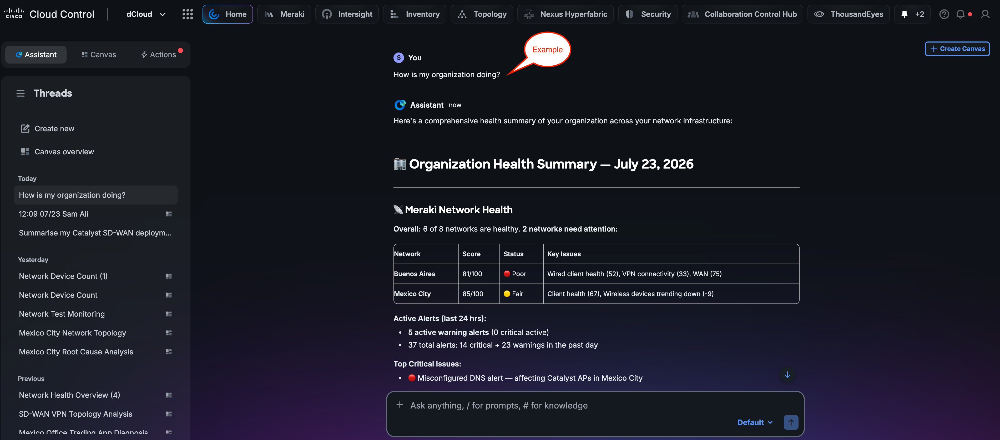

---

!!! info "Note"
    Actual responses will vary due to the nature of Agentic Systems

## Step 3: Explore 9-Dot Menu

Click the **9-dot menu** (grid icon) located in the top navigation bar of Cloud Control to explore the available options and applications.

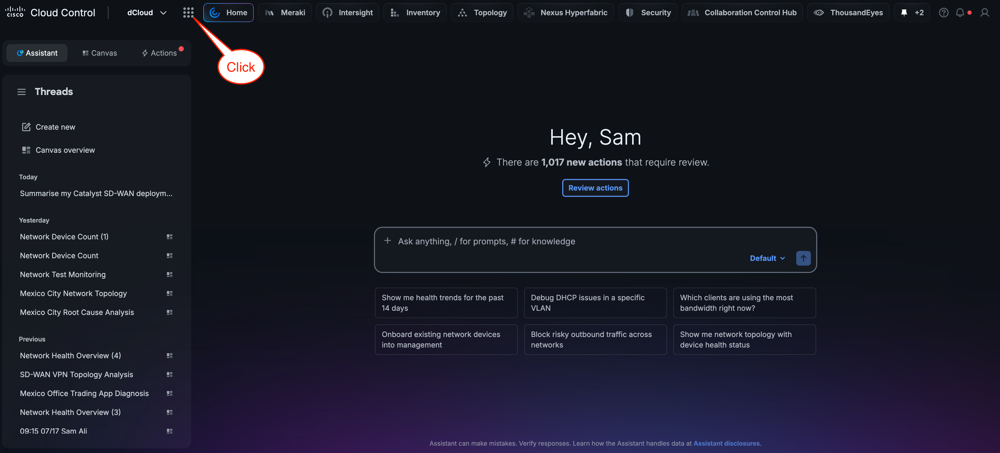

Explore the three main sections available on the platform.

1. **Platform Services** — These services span the entire infrastructure. Each will be explored in detail throughout this lab. Additional services, such as Fabric, will continue to be added over time.

2. **Products** — These are the products currently integrated with your tenant. In this lab, only Meraki is integrated. In a production environment, multiple products would typically be present. For a full list of supported products and onboarding requirements, visit the [Cloud Control Onboarding SharePoint site](https://cisco.sharepoint.com/sites/CiscoCloudControl-ControlledAvailability/SitePages/Home.aspx).

3. **Apps** — Common applications residing in Cloud Control.

4. **Favorites** — Save frequently visited pages from any product in this section for quick access during future sessions.

!!! info "Note"
    Click a Platform Service or Product to pin it to the navigation bar. This bar remains visible throughout Cloud Control, enabling quick and consistent access regardless of where you navigate.

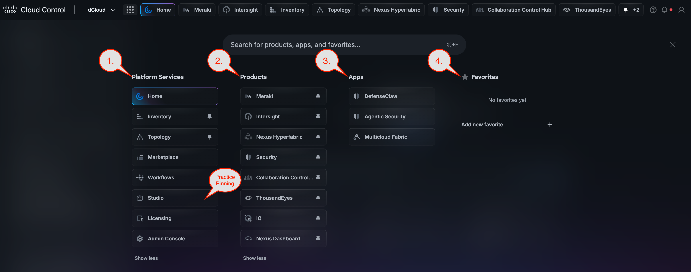

## Step 4: Explore Inventory Capabilities

Navigate to the **Inventory** section of Cisco Cloud Control to explore the available inventory capabilities.

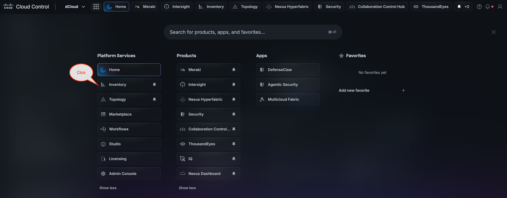

Next, explore the available capabilities. Review the Inventory Insights dashboard to examine detected issues, recommendations, and asset visibility across your managed devices.

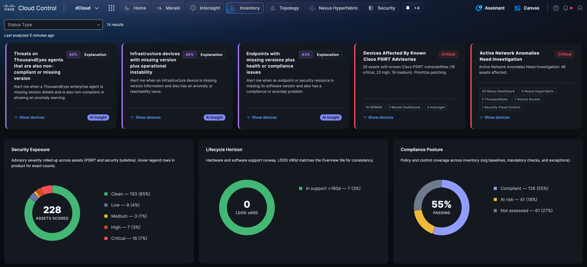

Click **Show Device Inventory** or select an alternative view to change the display format.

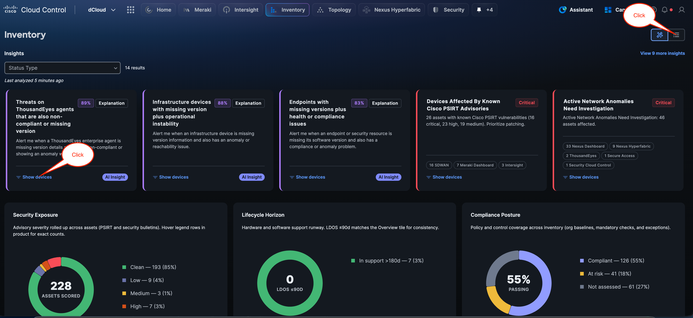

Practice using the **AI-assisted search** functionality within the Inventory section. **Collaborate** with your team to explore the available Inventory capabilities, including filtering, sorting, and device categorization options.

**Step 1 —** Enter the sample prompt below into the AI-Assisted Search and press Enter:

```
show me my Mexico City Devices
```

**Step 2 —** **Click** the **C9300-X-Leaf-1** switch to view it.

**Step 3 —** Observe the device details panel that opens on the right side of the screen. This panel displays comprehensive information for your **C9300-X-Leaf-1** switch. Review the **General** tab, which provides a high-level device overview including key operational indicators. Confirm that the Reachability status shows ***Reachable***, indicating the device is actively communicating with the management platform, and that the Compliance status shows ***Compliant***, confirming the device configuration meets your organisation's defined policy standards.

**Step 4 —** **Click** **View in Topology**. This will take you directly to the switch in the Global Topology Service.


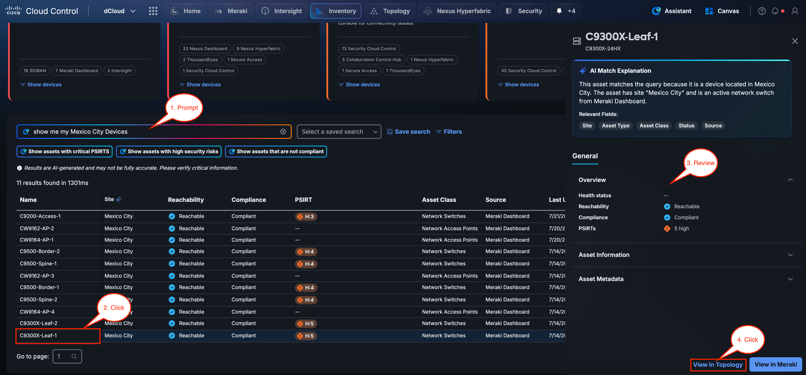

The Topology view displays your global network topology organized by site, providing a visual representation of device relationships and connectivity across your environment. In this case, we pivoted directly to the **C9300-X-Leaf1 i**n the local site topology. Notice the navigation options available to go directly to the device in Meraki or pivot back to the device in inventory.

To demonstrate the seamless pivot to the** Mexico City** network, **Click Meraki** on the top navigation banner.

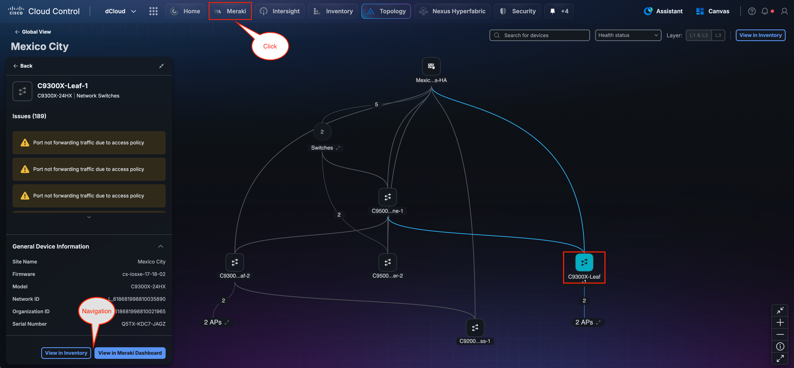

This action opens the Meraki Dashboard in context for the selected device, demonstrating the seamless cross-platform navigation capability within Cisco Cloud Control.

This integration allows network administrators to move fluidly between unified inventory management and platform-specific dashboards without separately logging in or searching for the device within Meraki.

Notice the top navigation bar, which reflects the unified Cloud Control interface. Click **Home** to return to the Cloud Control home screen, or click any other element in the banner to navigate directly to it. These tabs allow you to seamlessly move between management planes within a single dashboard.

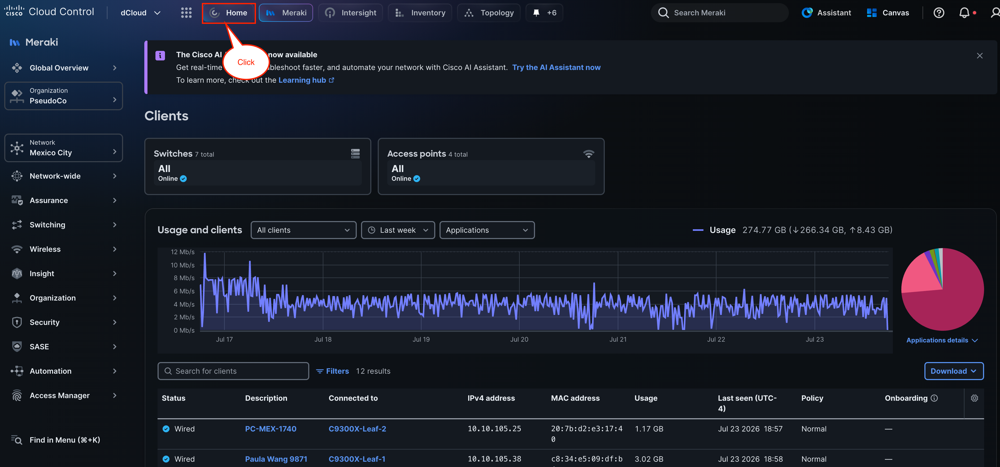

!!! abstract "Congratulations"
    Congratulations on completing this section! You have successfully navigated the Cisco Cloud Control platform and gained hands-on experience with its core services, including the AI Assistant, Inventory, and Topology. These foundational skills will serve as building blocks as you progress through the remaining sections of this lab.
