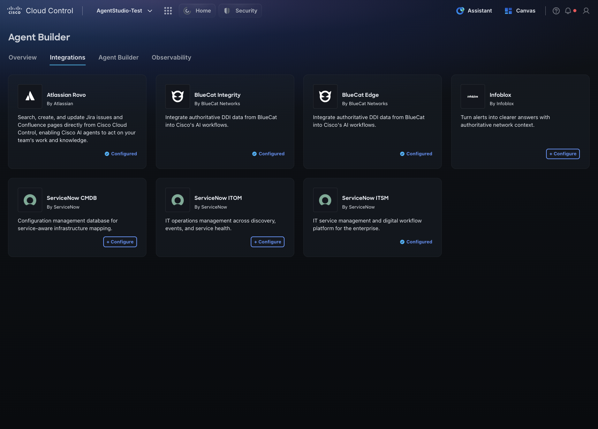
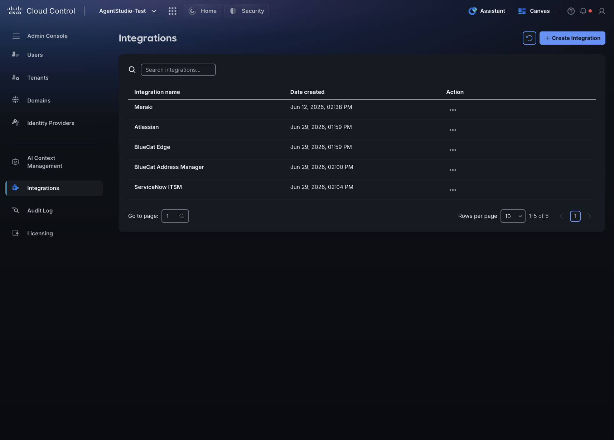
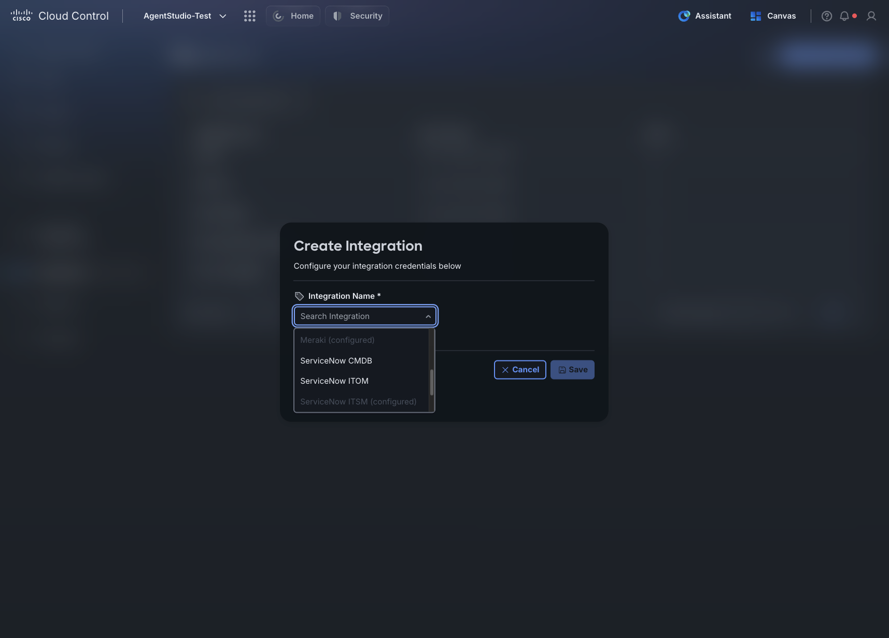
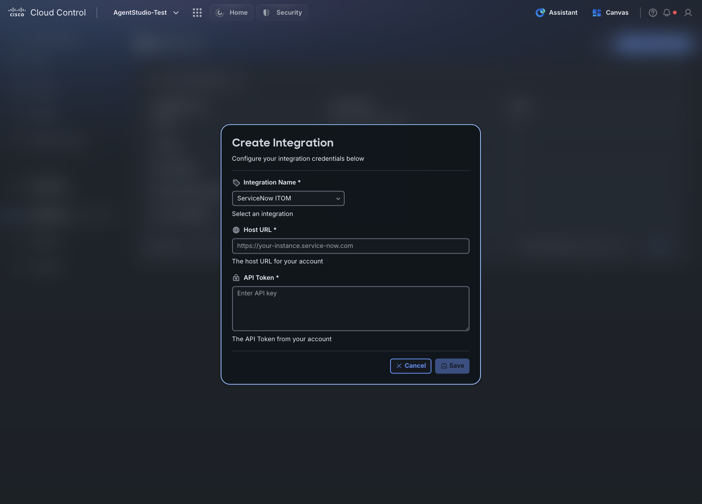
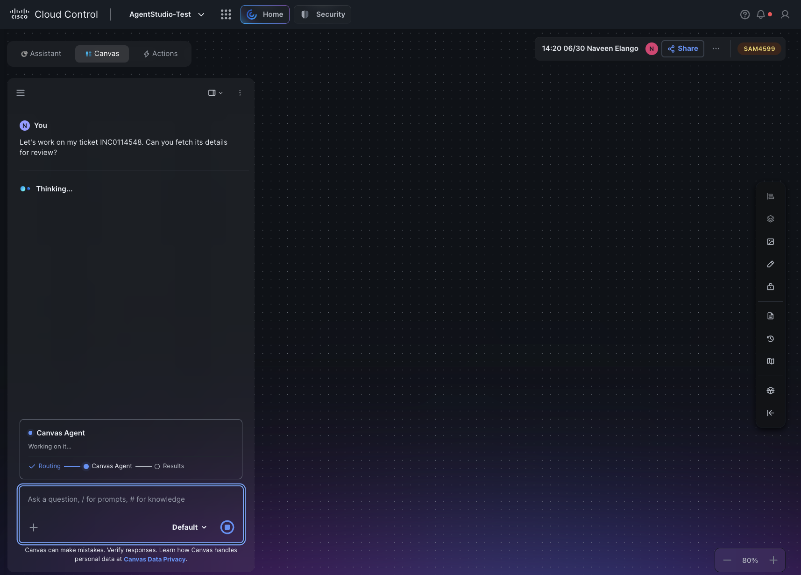
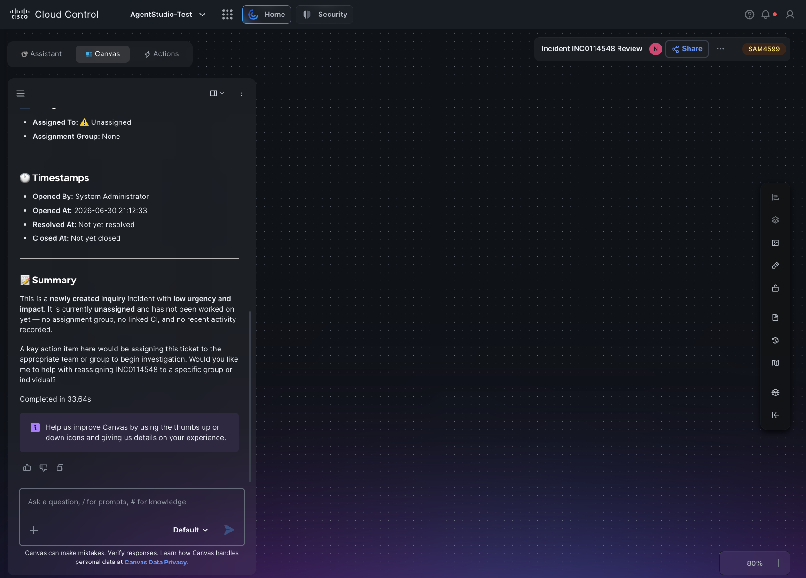

# Section 1: Third-Party Integrations

## Step 2: What Are Integrations?

Integrations connect Agent Builder to your third-party tools — ServiceNow, Atlassian, Infoblox, BlueCat, and others. Each integration is backed by an MCP server that exposes the vendor’s API as callable tools. Once connected, AI Canvas can use those tools to query data and take actions in that vendor’s platform on your behalf.

## Step 3: Browse the Integration Catalog

Click the Integrations tab. You will see a tile catalog with one tile per available MCP server. Each tile shows the vendor name, product description, and either a + Configure button (not yet connected) or a ✓ Configured checkmark (already connected) in the bottom right corner.

## Step 4: 1.2 Configure an Integration

Clicking + Configure on a tile cross-launches you into the Integrations section of the Admin Console. You can also navigate there directly:

Click the nine-dots menu → Admin Console (under Platform Services; click Show more if not visible) → Integrations.

Click + Create Integration in the top right.

In the pop-up, click the Integration Name drop-down and select the integration you want to set up.

After selecting an integration, additional fields appear specific to that vendor. Enter your credentials.

See Appendix A for what each vendor requires and where to find those values.

Click Save.

The integration appears in the table on the Admin Console Integrations page with the name and date created. You can Edit or Delete it from that table. Only one active credential entry is supported per integration — to update credentials, edit the existing entry.

Each user configures their own credentials. Repeat this process for every integration you want to connect.

## Step 5: 1.3 Verify the Connection

Return to the Integrations tab in Studio. Each integration you configured will now show a ✓ Configured checkmark instead of + Configure.

## Step 6: 1.4 Use Your Integrations in Canvas

Go to AI Canvas and enter a natural language query. Canvas routes the query to the appropriate integration based on context.

What you can ask depends on which tools that vendor’s MCP server exposes. Canvas fetches the relevant data and returns a structured result.

See Appendix B for the full tool list per integration.

Sample queries:

“Fetch details for ServiceNow ticket INC0012345”

“Show me all open P1 incidents in ServiceNow”

“What are the open Jira issues in the NETOPS project?”

“Check DHCP utilization for the 10.150.28.0/24 subnet”

