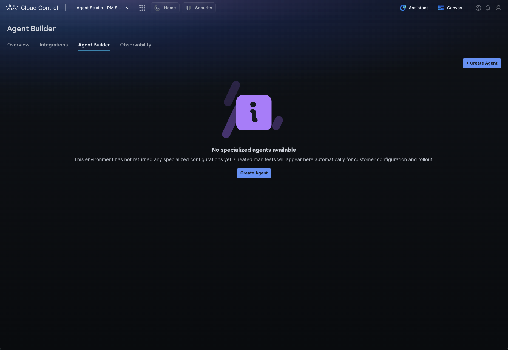
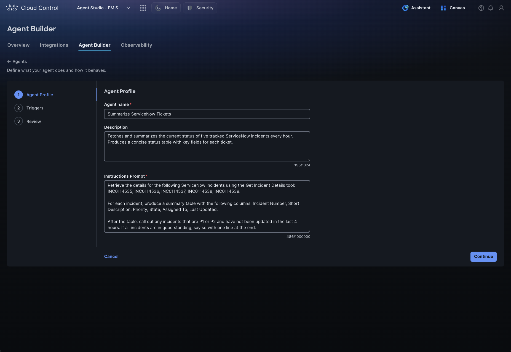
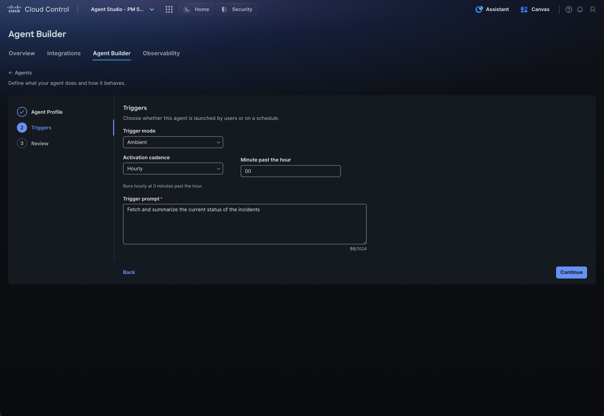
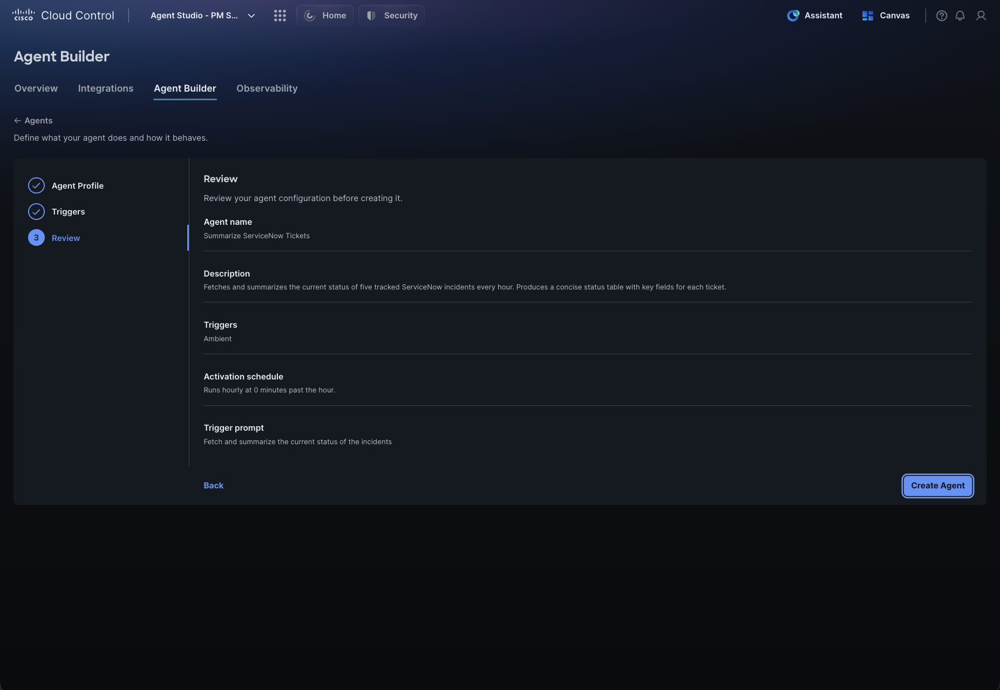
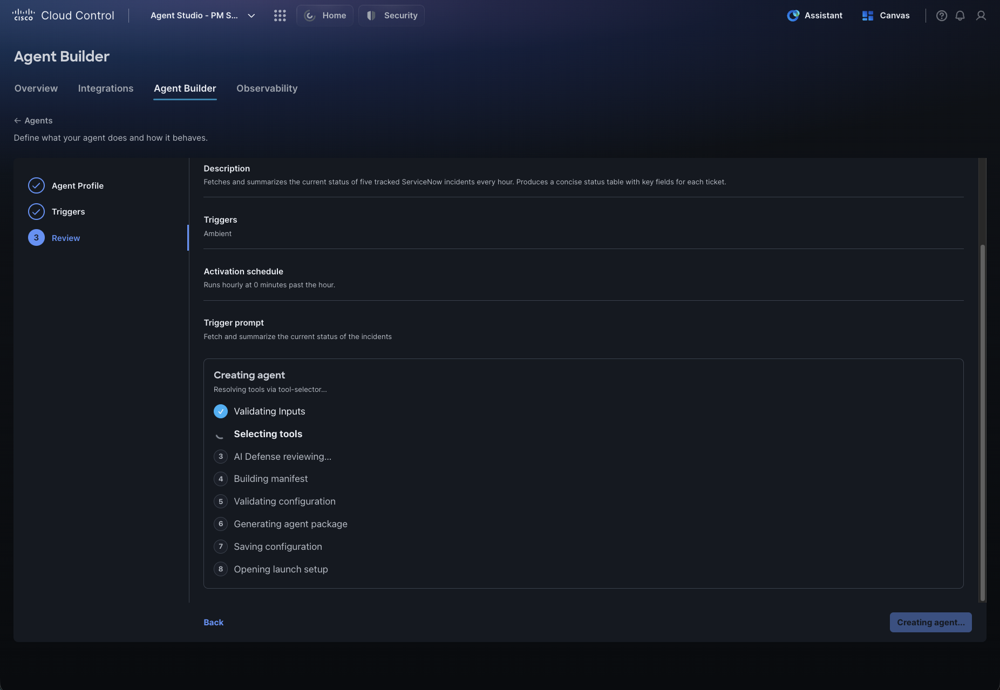
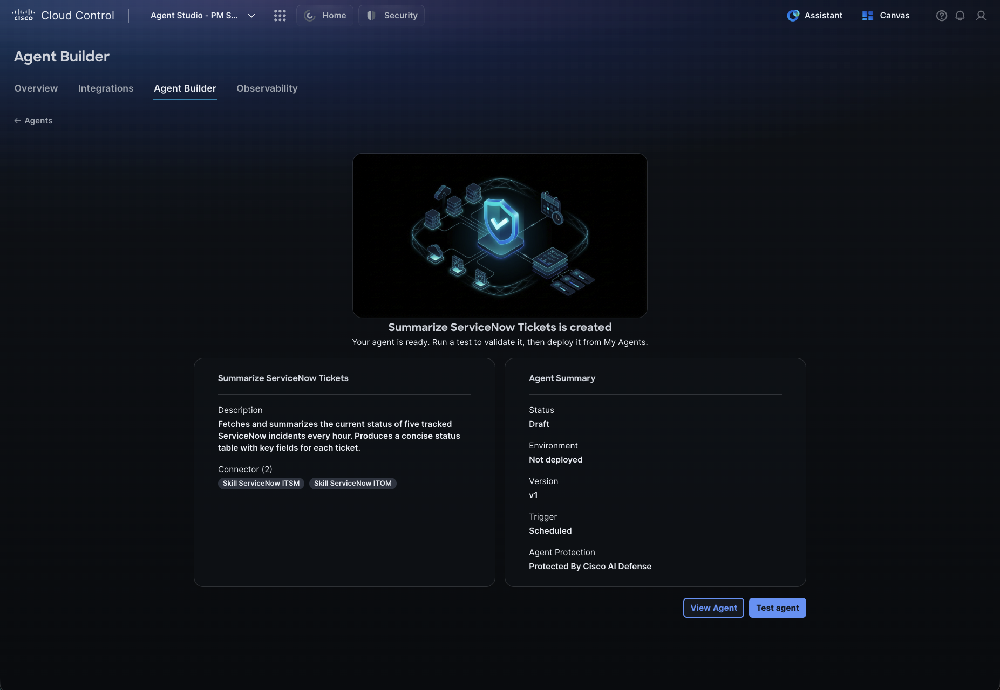
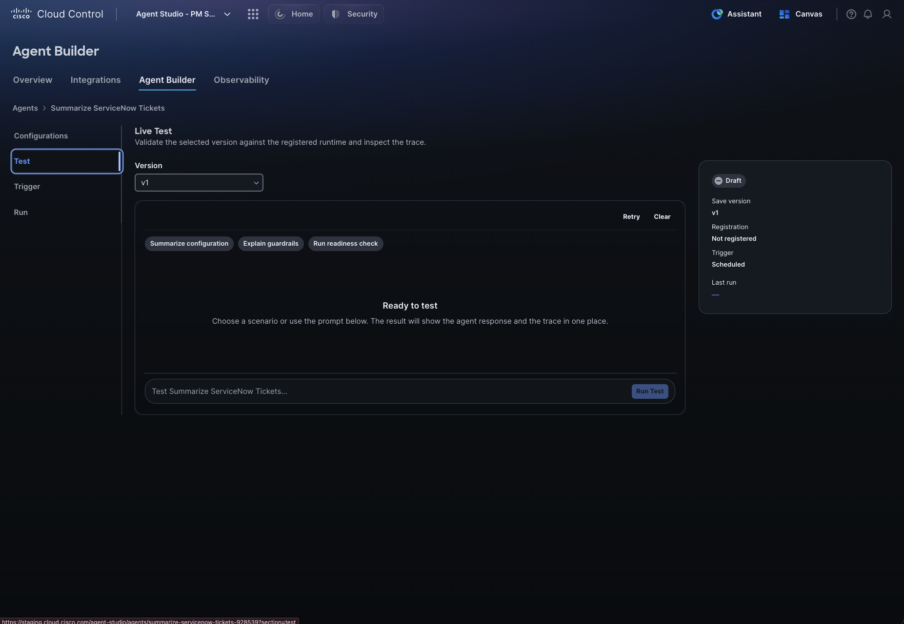
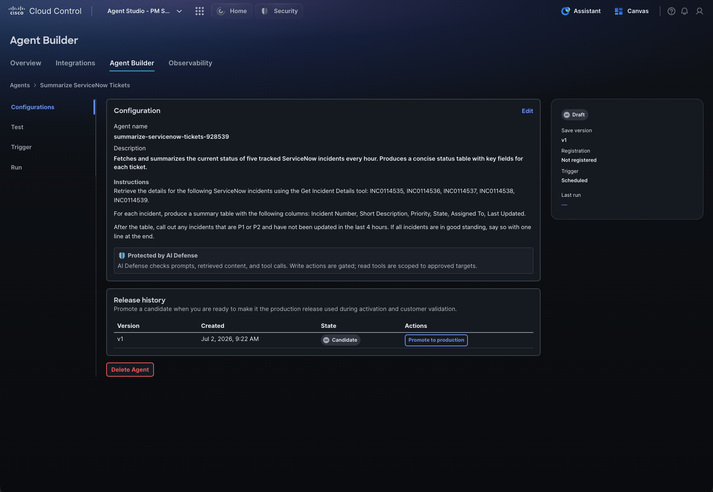
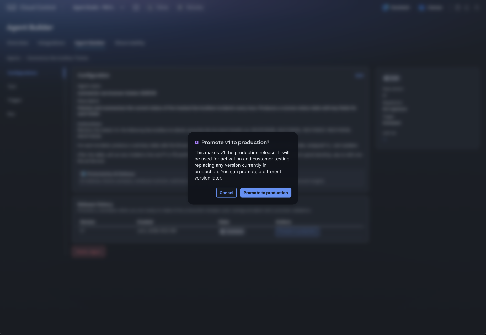
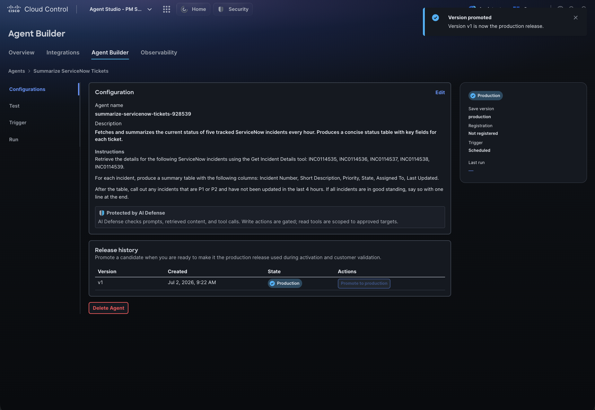

# Section 2: Agent Builder

## Step 1: 2.1 Creating an Agent

Before creating an agent, verify that all integrations the agent will need are already configured:

Cisco product tools (Meraki, ThousandEyes, Catalyst SD-WAN, etc.) are available by default — no setup required.

Third-party integrations (ServiceNow, Atlassian, Infoblox, BlueCat, etc.) must be configured in Admin Console before you can use them in an agent. See Section 1 for setup steps.

Click the Agent Builder tab. If no agents have been created yet, you will see a Create Agent call to action in the center of the page, along with a + Create Agent button in the top right.

Click either to start the agent creation flow. Agent creation has three steps: Agent Profile → Triggers → Review.

## Step 2: Step 1: Agent Profile

Tips for writing good instructions:

Be specific about what data to pull and from which source

Specify the output format (e.g., a table with specific columns)

Include thresholds or conditions to flag (e.g., “flag any incident not updated in the last 4 hours”)

Once the required fields are filled in, click Continue.

## Step 3: Step 2: Triggers

Trigger Mode determines how the agent is activated. Select a mode from the drop-down:

Currently, only Ambient mode is available.

Activation Cadence — Set how often the agent runs:

Trigger Prompt — Enter the prompt sent to the agent each time it wakes up. The Instructions from Step 1 define how the agent behaves; the trigger prompt is the specific request it executes on each run. Keep it concise.

Example:

“Fetch and summarize the current status of the incidents.”

Click Continue when done. You can click Back at any point to return to the previous step.

## Step 4: Step 3: Review

The Review page shows a summary of everything you configured — agent name, description, trigger mode, activation schedule, and trigger prompt. Verify the details look correct, then click Create Agent.

## Step 5: What Happens When You Click Create Agent

Studio runs through a series of automated steps that typically take one to a few minutes:

Validating inputs — Checks that all required fields are present and correctly formatted

Selecting tools — Automatically identifies and scopes the MCP tools this agent needs based on its instructions and integrations. The agent only has access to the tools relevant to its job, which improves accuracy, reduces token usage, and makes it faster. In a future release, you will be able to see and modify this tool scope directly.

AI Defense reviewing — Scans the agent configuration for safety and security issues

Building manifest — Assembles the agent’s runtime manifest

Validating configuration — Validates the full configuration package

Generating agent package — Generates the deployable agent artifact

Saving configuration — Persists the agent configuration

Opening launch setup — Initializes the agent and opens the confirmation page

Once complete, a confirmation page shows the agent name, description, and a summary of its configuration including status, version, trigger type, and AI Defense protection.

Two buttons are available:

## Step 6: 2.2 Testing Your Agent

The Test tab provides a live test environment where you can chat directly with the agent to verify it responds correctly before promoting it to production.

Pre-canned prompts at the top let you run common checks with a single click:

Summarize configuration — Agent summarizes its own setup

Explain guardrails — Agent describes its safety constraints

Run readiness check — Agent confirms it can reach its configured integrations and tools

You can also type anything directly into the prompt box. A good starting point is to enter the trigger prompt you configured and verify the agent returns the expected output.

## Step 7: 2.3 Managing Your Agent

The agent detail page has four tabs:

## Step 8: Versions and Promoting to Production

When an agent is first created, it starts as Version 1 in Candidate state, visible in the Release History table on the Configurations tab.

To promote an agent to production:

In the Configurations tab, find the Release History table.

On the V1 row, click Promote to production under Actions.

A confirmation pop-up will appear. Review the details, then click Promote to production to confirm, or Cancel to go back.

The version is promoted instantly. A confirmation banner appears and the version badge in the Release History table updates to Production. The agent will now begin running on the schedule you configured.

Once in production, you can:

Update the config — Edit the agent’s profile or instructions to create a new version, test it, and promote it when ready

Monitor runs — Check the Run tab to see execution history, outputs, and any errors

Update the trigger — Go to the Trigger tab to change the cadence or trigger prompt

Roll back — Promote any previously published version from the Release History table

Delete the agent — Remove the agent entirely from the agent detail page if it is no longer needed

## Step 9: 2.4 Observability

Each time an ambient agent completes a run, its output appears in the Notifications pane in the Cloud Control header — one notification per run. To view results:

Click the notifications icon in the Cloud Control header.

Find the notification for the run you want to review and click on it.

The full output produced by that run will be displayed.

Use the Download option to export the output if needed.
