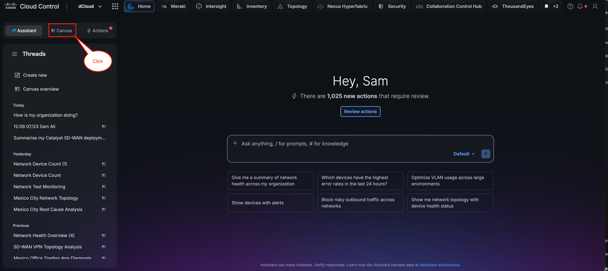
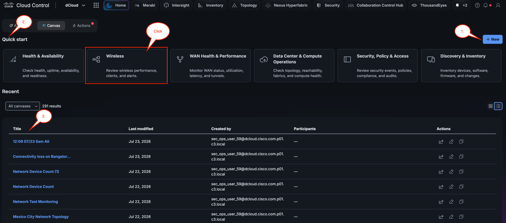
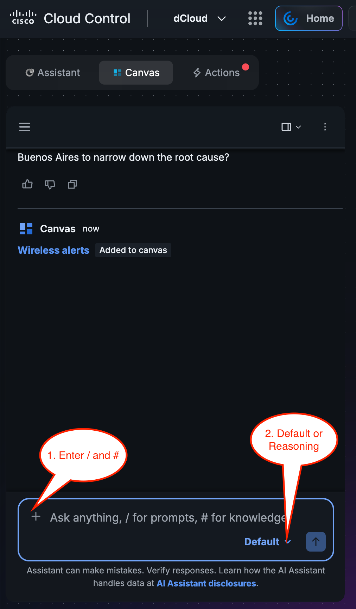
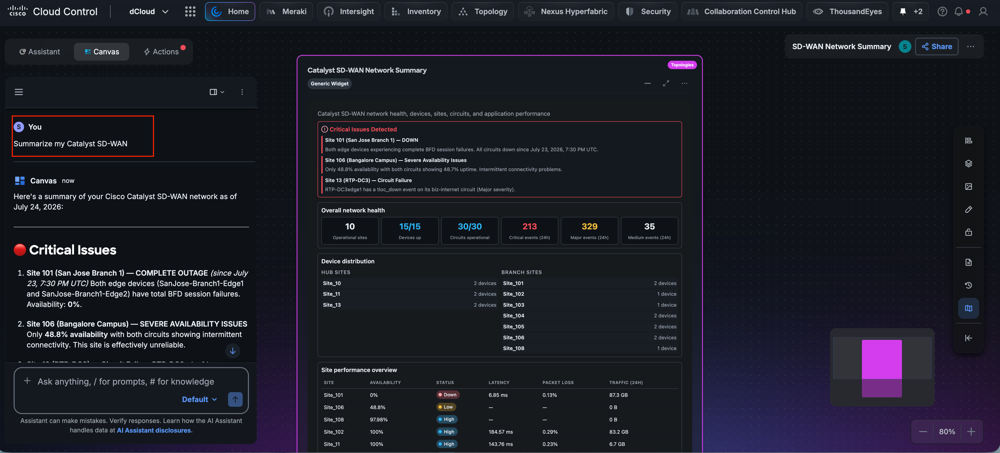
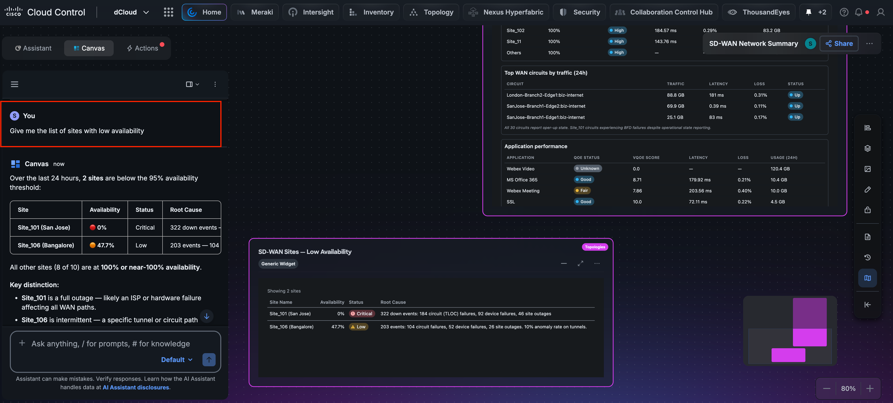
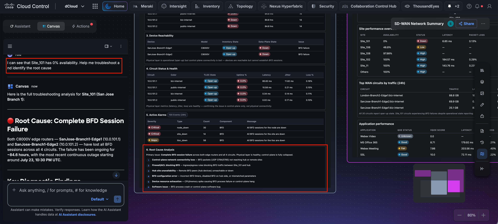

# Section 2: Experience the Agentic AI Canvas

In this section we will explore the AI Canvas and Agentic Ops capabilities in Cisco Cloud Control

Start on the Home section by **clicking Canvas**.

---

---

Now in the AI Canvas section you will see:

1. The ability to create a **New Canvas**

1. The **Quick Start** tiles, which allow you to run a set of pre-populated prompts

1. The **Recent** list of Canvases

Next, **click** the Wireless Quick Start tile and let's put AI Canvas to work.

---

---

Next, watch closely as AI Canvas **generates the Wireless session**, reviewing wireless performance, clients, and alerts in the environment.

Once it completes, **spend some time exploring** the various capabilities of the Canvas interface, such as the ability to share and invite others, annotate, resize cards, generate a summary, and more.

---

1. Within Canvas, practice entering **/** for a set of pre-populated prompts and **#** for accessing and managing a knowledge base of context to leverage.

1. Notice that you can toggle between **Default** and **Reasoning Mode**. See the detailed differences below:

**Default mode** uses a standard language model optimized for speed and general-purpose assistance. It is well-suited for everyday tasks such as writing boilerplate code, asking quick questions, getting explanations, or making minor code edits. Responses are generated quickly, making this mode ideal when you need fast, iterative feedback during active development.

**Deep Reasoning mode** leverages a more advanced model capable of multi-step reasoning and complex problem analysis. This mode is better suited for tasks that require careful, methodical thinking, such as:

- Debugging complex, hard-to-reproduce issues that span multiple files or systems.

- Architecting solutions to intricate design problems where trade-offs need to be carefully considered.

- Analyzing algorithms for correctness, performance, or edge cases.

- Working through problems that require the model to plan several steps ahead before producing an answer.

The trade-off with Deep Reasoning mode is that responses take longer to generate due to the additional computational steps involved. For straightforward tasks, Default mode will typically be faster and sufficient, while Deep Reasoning mode is most valuable when accuracy and thoroughness outweigh the need for speed.

---

---

The** final step** in this section is to review the **Sample Customer Scenarios** in **Appendix C**. Select one scenario, create a **New Canvas**, and use **defaut or reasoning **to identify the root cause analysis **(RCA)** for the given scenario. Collaborate with your team and share your successes. 

**Next  is an example of how to work through an RCA using AI Canvas**

---

The scenario below involves a **Network Operator** who wants to perform Root Cause Analysis (**RCA**) on **SD-WAN sites that are down**. The progression of prompts used is outlined below, and the screenshots are provided for your reference. Please use the scenarios in **Appendix C for your actual RCA**.

**Example sequence of prompts you can use:**

**Prompt #1 **Summarize my Catalyst SD-WAN deploymentCopy

**Prompt #2 **Give me the list of sites with low availability

**Prompt #3 **I can see that Site_101 has 0% availability. Help me troubleshoot and identify the root cause

**Example screenshots below:**

---

---

---

---

!!! abstract "Congratulations"
    You now have the foundational knowledge required to work effectively with the **Agentic AI Canvas**. This concludes the section.
