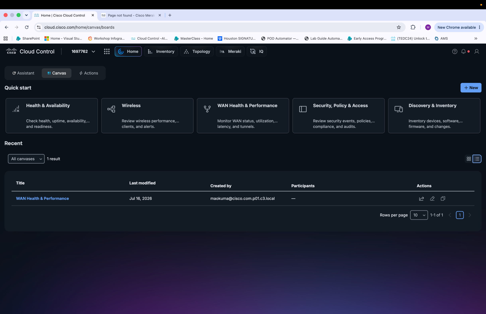
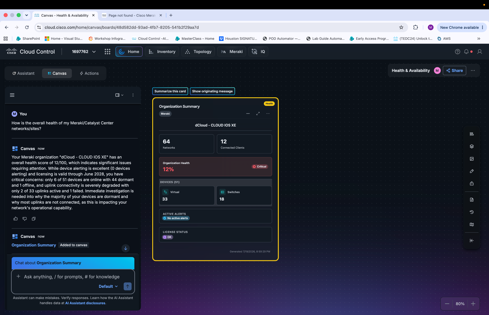

# Section 2: Experience the Agentic AI Canvas

In this section we will explore the AI Canvas and Agentic Ops capabilities in Cisco Cloud Control

Lauch AI Canvas

Notice that the AI Assistant has responded to your health query and automatically generated an **Organization Summary** card on the Canvas, displaying the overall health of your Meraki organization 

Review the card details, which highlight key concerns including devices online, dormant devices, and severely degraded uplink connectivity.

Click **Summarize this card** at the top of the canvas to have the AI Assistant generate a concise summary of the organization health data, or type a follow-up question in the chat input field to drill deeper into a specific issue such as dormant devices or uplink failures.

Highlight the / and # shortcuts for the prompt and what capabilities those provide. Also explore the differences between  Default and Deep Reasoning mode

**Default** mode and **Deep Reasoning**

**Default mode** uses a standard language model optimized for speed and general-purpose assistance. It is well-suited for everyday tasks such as writing boilerplate code, asking quick questions, getting explanations, or making minor code edits. Responses are generated quickly, making this mode ideal when you need fast, iterative feedback during active development.

**Deep Reasoning mode** leverages a more advanced model capable of multi-step reasoning and complex problem analysis. This mode is better suited for tasks that require careful, methodical thinking, such as:

- Debugging complex, hard-to-reproduce issues that span multiple files or systems.

- Architecting solutions to intricate design problems where trade-offs need to be carefully considered.

- Analyzing algorithms for correctness, performance, or edge cases.

- Working through problems that require the model to plan several steps ahead before producing an answer.

The trade-off with Deep Reasoning mode is that responses take longer to generate due to the additional computational steps involved. For straightforward tasks, Default mode will typically be faster and sufficient, while Deep Reasoning mode is most valuable when accuracy and thoroughness outweigh the need for speed.
