# Section 3: Build an Agent with Agent Builder

In this section, you will use Agent Builder to configure and deploy a functional agent. You'll explore available integrations and connect the necessary components to bring your agent to life.

Agent Builder is Cisco's platform for designing, deploying, and managing autonomous AI agents that execute tasks on a defined schedule, as well as for integrating third-party tools and services directly into AI Canvas workflows. Autonomous agents built on this platform can perform complex, multi-step operations without requiring manual intervention — such as monitoring data sources, triggering alerts, processing records, or coordinating actions across connected systems. The scheduling capability allows agents to run at specified intervals or in response to defined conditions, making them well-suited for recurring business processes and automated data pipelines. The third-party integration layer extends AI Canvas by allowing external applications, APIs, and services to participate in AI-driven workflows, enabling a unified environment where both Cisco-native and external tools can collaborate seamlessly. This guide walks through the initial platform setup, the step-by-step process of building and configuring agents, and the methods available for connecting and managing third-party integrations.

First, we will navigate to Agent Builder:

1. Click the **nine-dots menu** in the top header.

1. Under **Platform Services**, click **Studio**. If it is not visible, click **Show more** to expand the list.

1. If **Studio** has been pinned, you can also click it directly from the header.

This opens the Agent Builder **Overview** page. The top navigation bar has four tabs: **Overview**, **Integrations**, **Agent Builder**, and **Observability**.

Next, notice the **Studio** overview page within Cisco Cloud Control, which serves as the central hub for building and managing AI agents. Observe the four navigation tabs at the top: **Overview**, **Integrations**, **Agent Builder**, and **Observability**.

To begin building your first agent, click **+ Create Agent** to launch the Agent Builder workflow, or click **+ Browse Integrations** to first explore and configure the available integrations that your agent will use.

On a fresh setup, the Overview page displays two calls to action: **Browse Integrations** and **Create an Agent**. It also shows three summary cards — agents currently running, total active agents, and number of connected integrations — along with a **Recent Agent Activity** section and a **Connected Integrations** section.

Agent creation has three steps: **Agent Profile → Triggers → Review**.

### Step 1: Agent Profile

| Field | Required | Description |
| --- | --- | --- |
| **Agent Name** | Yes | A clear, descriptive name for the agent |
| **Description** | No | A short summary of what the agent does — displayed on the agent card |
| **Instructions** | Yes | The system prompt — detailed instructions defining what the agent should do, what data to retrieve, and how to format its output |

**Tips for writing effective instructions:**

- Be specific about what data to retrieve and from which source

- Specify the output format (e.g., a table with defined columns)

- Include thresholds or conditions to flag (e.g., "flag any incident not updated in the last 4 hours")

To help provide context and guidance while creating your first agent, please refer to the examples provided in [**Appendix B: Sample Agent Prompts**](../appendix-b-sample-agent-prompts/). Appendix B contains several pre-built prompt examples that demonstrate best practices for structuring agent instructions, defining scope, and setting expected behaviors. You are welcome to explore and create agents based on any of the examples listed, and you are encouraged to experiment with multiple configurations throughout this lab.

However, for this first agent, please use the [**Meraki Daily Health Report**](../appendix-b-sample-agent-prompts/#meraki-daily-health-report-agent) example from Appendix B. This sample prompt is designed to instruct the agent to automatically gather and summarize key health metrics from your Meraki network environment — such as device connectivity status, alert summaries, and performance indicators — and present them in a structured, easy-to-read daily report format. Using this example as your starting point will ensure you have a consistent baseline configuration that aligns with the exercises and validation steps in the sections that follow.

On the **Agent Profile** page, the first step is configuring your new agent's name. Set the **Agent name** **(1)** to meraki-daily-health-report.

Next, configure the **Description** **(2)** with "**Generates a Daily Meraki Health Report**."

Finally, configure the **Instructions Prompt** **(3)** with the detailed sample prompt from [**Appendix B: Sample Agent Prompts**](../appendix-b-sample-agent-prompts/#meraki-daily-health-report-agent), which defines the agent's behavior and report structure.

Once you have reviewed all three fields and confirmed the information is correct, click the **Continue** button in the bottom-right corner to proceed to the next step.

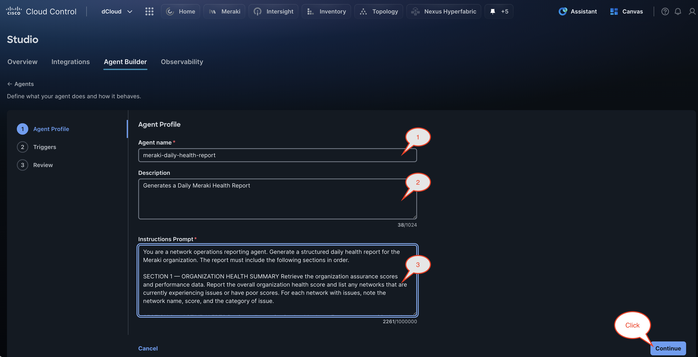

On the triggers configuration page, configure the following agent settings:

- Set the Trigger mode to **Ambient**

- Set the Activation cadence to **Daily**

- Set the Local run time to **09:00 AM**

This means the agent will run **automatically every day at 9:00 AM local time**.

In the Trigger prompt field, enter **"Generate the Meraki Daily Health Report"**. This defines the instruction the agent will execute during its scheduled runs.

Click the **Continue** button in the bottom-right corner of the screen to proceed to the Review step and finalize the agent configuration.

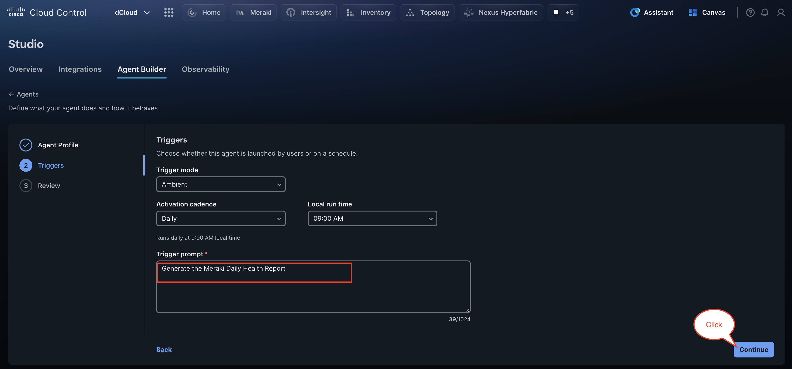

!!! info "Note"
    **Trigger Mode** determines how the agent is activated

    - **Ambient:** Agent runs automatically on a schedule

    - **Interactive:** Agent is available for users to invoke in Canvas *(****coming soon****)*

    - **Ambient + Interactive:** Agent runs both *(****coming soon****)*

Review the agent configuration summary, which displays the following:

- Agent name: **meraki-daily-health-report**

- Description: **Generate a Daily Meraki Health Report**

- Trigger type: **Ambient**

- Activation schedule: **Runs daily at 9:00 AM local time**

- Trigger prompt: **Generate the Meraki Daily Report**

Verify that all settings are correct before proceeding. Click the **Create Agent** button in the bottom-right corner of the screen to finalize and deploy your agent.

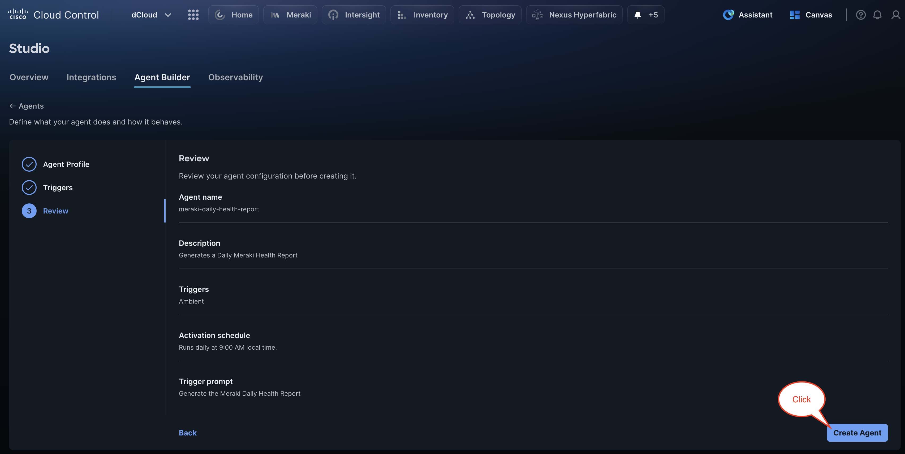

#### What Happens When You Click Create Agent

Studio runs through a **series of automated steps** that typically take one to a few minutes:

1. **Validating inputs** — Checks that all required fields are present and correctly formatted.

1. **Selecting tools** — Automatically identifies and scopes the MCP tools the agent needs based on its instructions and integrations. The agent only has access to the tools relevant to its role, which improves accuracy, reduces token usage, and increases speed. In a future release, you will be able to view and modify this tool scope directly.

1. **AI Defense reviewing** — Scans the agent configuration for safety and security issues.

1. **Building manifest** — Assembles the agent's runtime manifest.

1. **Validating configuration** — Validates the full configuration package.

1. **Generating agent package** — Generates the deployable agent artifact.

1. **Saving configuration** — Persists the agent configuration.

1. **Opening launch setup** — Initializes the agent and opens the confirmation page.

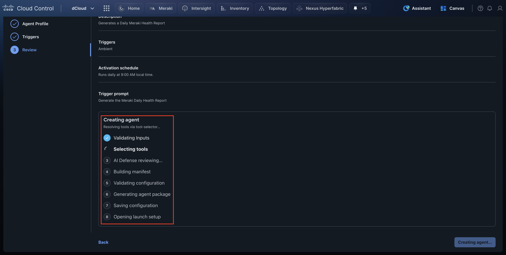

The **meraki-daily-health-report** agent has been successfully created and is now in **Draft** status, ready for validation. Review the Agent Summary panel on the right, which confirms that the agent is not yet deployed, is set to version **v1**, uses a **Scheduled** trigger, and is protected by **Cisco AI Defense**. Observe the connectors listed on the left, which include a variety of Meraki data retrieval and display actions that the agent will utilize when generating the daily health report. Click **Test Agent** to validate the agent's functionality before proceeding to deployment.

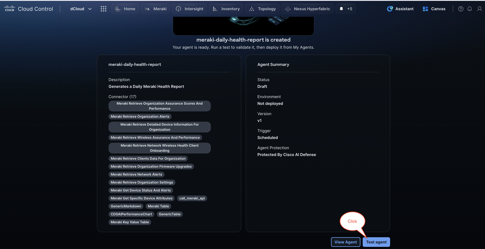

Next, inspect the **Live Test** panel, which allows you to validate the selected agent version against the registered runtime and inspect the execution trace. Enter the test prompt *"****Generate the Daily Meraki Health Report****"*  in the input field at the bottom of the panel.

Click the **Run Test** button to execute the agent and generate the daily Meraki health report. The results, including the agent response and full execution trace, will appear directly within this panel.

There are also several pre-built scenarios you can run and explore the outputs of:

- Summarize Configuration

- Explain Guardrails

- Run Readiness Check

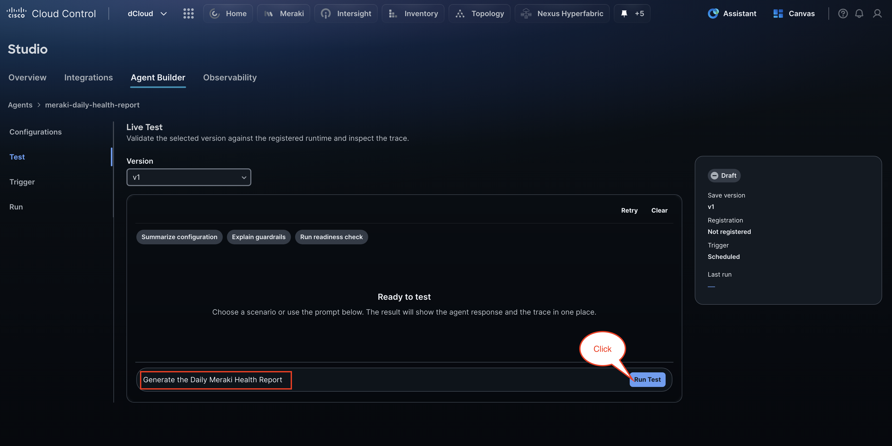

Next, review that the **Live Test** has successfully executed the agent, displaying the generated **Daily Meraki Health Report**. Review the key findings highlighted in the summary report.

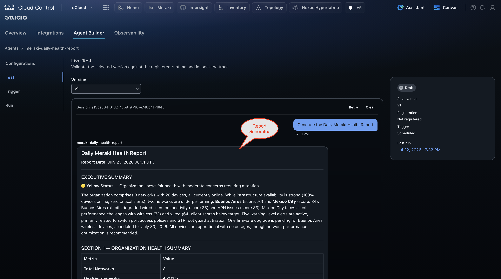

Next, we will review the Agent configuration and then promote the agent to production.

First, **click** back to the **Overview** page, then **click** on the newly created agent to open it.

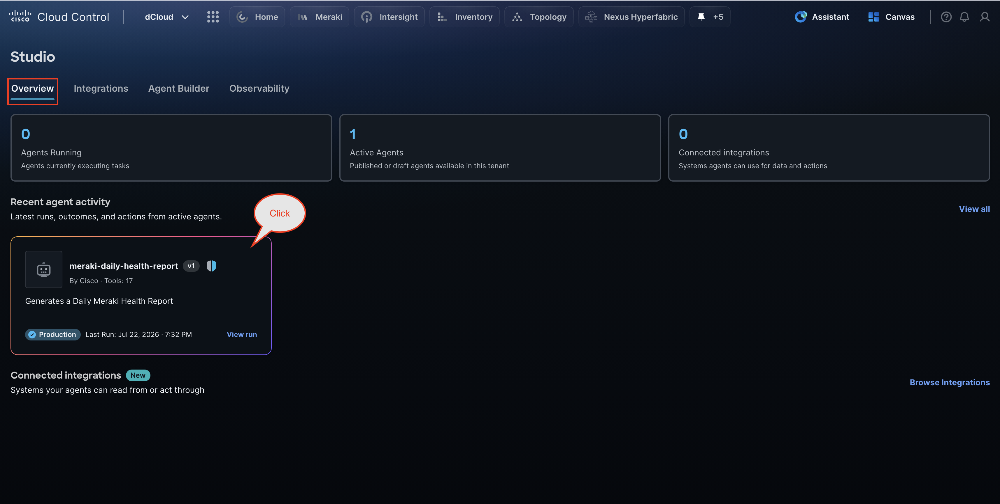

Review the agent configuration, which contains detailed instructions for generating a structured six-section daily health report covering organization health, active alerts, device status, wireless performance, firmware compliance, and an executive summary.

Notice that the agent is **Protected by AI Defense**, which checks prompts, retrieved content, and tool calls to ensure write actions are gated and read tools are scoped to approved targets.

In the **Release history** section at the bottom of the page, observe that version **v1** is currently in a **Candidate** state.

Finally, click **Promote to production** to make this version the active production release.

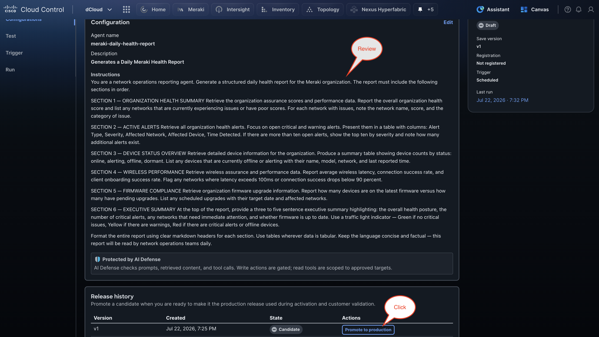

A confirmation dialog box will appear asking whether you want to promote v1 to production. *Notice that the dialog explains this will make v1 the active production release used for activation and customer testing, replacing any version currently in production.*

Click **Promote to production** to confirm the action and deploy v1 as the production release.

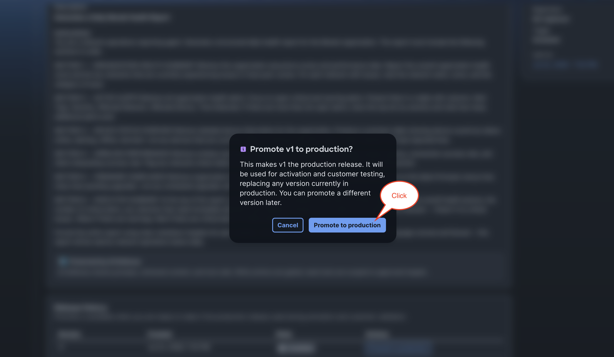

Once in production, you can:

- **Update the config** — Edit the agent's profile or instructions to create a new version, test it, and promote it when ready

- **Monitor runs** — Check the **Run** tab to view execution history, outputs, and any errors

- **Update the trigger** — Go to the **Trigger** tab to change the cadence or trigger prompt

- **Roll back** — Promote any previously published version from the Release History table

- **Delete the agent** — Remove the agent entirely from the agent detail page if it is no longer needed

Finally, click back on the **Observability** tab. This section displays a summary of all agent execution metrics available for review.

In the **Recent executions** table, you can see that our agent ran version **v1**, which was triggered by the **Scheduler** and completed with a status of **Passed**.

Click **Open run** to inspect the detailed execution trace and step-by-step results for this agent run.

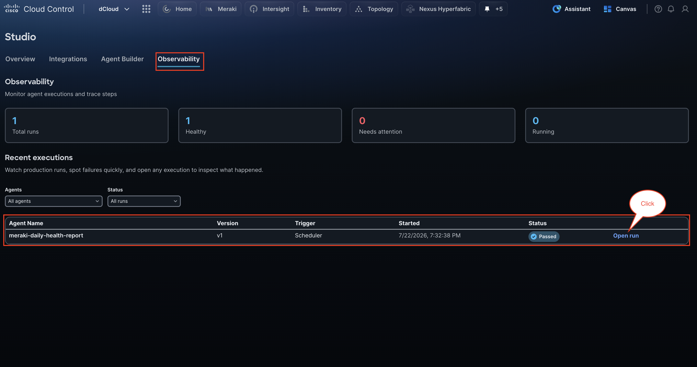

!!! abstract "Congratulations"
    Excellent work completing Section 3! You have successfully built, tested, and promoted your first production AI agent on Cisco Cloud Control — taking it all the way from a blank profile to a live, scheduled agent running autonomously in production. The skills you just practiced are exactly what you will need to tackle the Team Challenge ahead. 🎉
