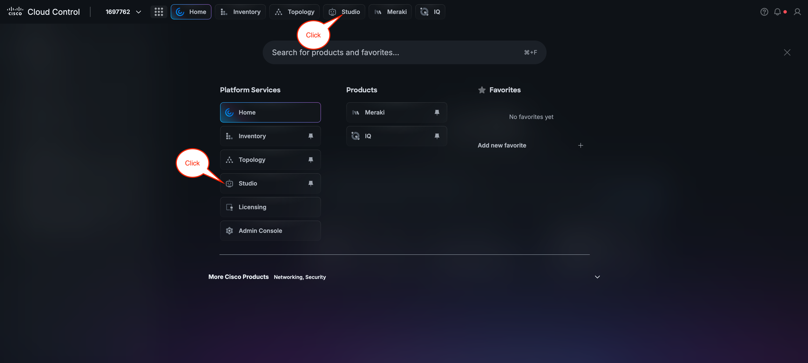
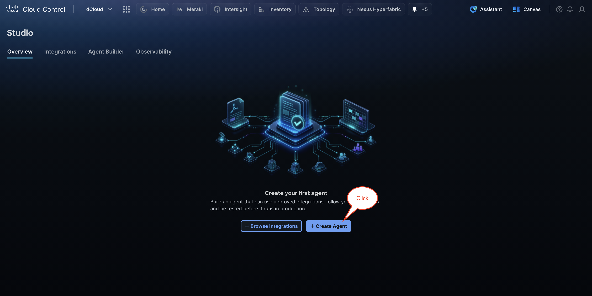

# Section 3: Build an Agent with Agent Builder

In this section, you will use Agent Builder to configure and deploy a functional agent. You'll explore available integrations and connect the necessary components to bring your agent to life.

Agent Builder is Cisco's platform for designing, deploying, and managing autonomous AI agents that execute tasks on a defined schedule, as well as for integrating third-party tools and services directly into AI Canvas workflows. Autonomous agents built on this platform can perform complex, multi-step operations without requiring manual intervention — such as monitoring data sources, triggering alerts, processing records, or coordinating actions across connected systems. The scheduling capability allows agents to run at specified intervals or in response to defined conditions, making them well-suited for recurring business processes and automated data pipelines. The third-party integration layer extends AI Canvas by allowing external applications, APIs, and services to participate in AI-driven workflows, enabling a unified environment where both Cisco-native and external tools can collaborate seamlessly. This guide walks through the initial platform setup, the step-by-step process of building and configuring agents, and the methods available for connecting and managing third-party integrations.

First, we will navigate to Agent Builder:

1. Click the **nine-dots menu** in the top header.

1. Under **Platform Services**, click **Studio**. If it is not visible, click **Show more** to expand the list.

1. If **Studio** has been pinned, you can also click it directly from the header.

This opens the Agent Builder **Overview** page. The top navigation bar has four tabs: **Overview**, **Integrations**, **Agent Builder**, and **Observability**.

Next, notice the **Studio** overview page within Cisco Cloud Control, which serves as the central hub for building and managing AI agents. Observe the four navigation tabs at the top: **Overview**, **Integrations**, **Agent Builder**, and **Observability**.

To begin building your first agent, click **+ Create Agent** to launch the Agent Builder workflow, or click **+ Browse Integrations** to first explore and configure the available integrations that your agent will use.

On a fresh setup, the Overview page displays two calls to action: **Browse Integrations** and **Create an Agent**. It also shows three summary cards — agents currently running, total active agents, and number of connected integrations — along with a **Recent Agent Activity** section and a **Connected Integrations** section.

Agent creation has three steps: **Agent Profile → Triggers → Review**.

#### Step 1: Agent Profile

| Field | Required | Description |
| --- | --- | --- |

 

| **Agent Name** | Yes | A clear, descriptive name for the agent |
| --- | --- | --- |
| **Description** | No | A short summary of what the agent does — displayed on the agent card |
| **Instructions** | Yes | The system prompt — detailed instructions defining what the agent should do, what data to retrieve, and how to format its output |

**Tips for writing effective instructions:**

- - Be specific about what data to retrieve and from which source

- Specify the output format (e.g., a table with defined columns)

- Include thresholds or conditions to flag (e.g., "flag any incident not updated in the last 4 hours")

To help provide context and guidance while creating your first agent, please refer to the examples provided in [**Appendix B: Sample Agent Prompts**](../appendix-b-sample-agent-prompts/). Appendix B contains several pre-built prompt examples that demonstrate best practices for structuring agent instructions, defining scope, and setting expected behaviors. You are welcome to explore and create agents based on any of the examples listed, and you are encouraged to experiment with multiple configurations throughout this lab.

However, for this first agent, please use the [**Meraki Daily Health Report**](../appendix-b-sample-agent-prompts/#meraki-daily-health-report-agent) example from Appendix B. This sample prompt is designed to instruct the agent to automatically gather and summarize key health metrics from your Meraki network environment — such as device connectivity status, alert summaries, and performance indicators — and present them in a structured, easy-to-read daily report format. Using this example as your starting point will ensure you have a consistent baseline configuration that aligns with the exercises and validation steps in the sections that follow.
