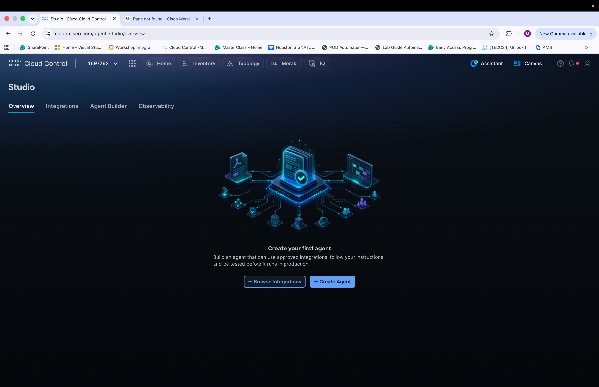

# Section 3: Build an Agent with Agent Builder

In this section, you will use Agent Builder to configure and deploy a functional agent. You'll explore available integrations and connect the necessary components to bring your agent to life.

Notice the **Studio** overview page within Cisco Cloud Control, which serves as the central hub for building and managing AI agents. Observe the four navigation tabs at the top: **Overview**, **Integrations**, **Agent Builder**, and **Observability**.

To begin building your first agent, click **+ Create Agent** to launch the Agent Builder workflow, or click **+ Browse Integrations** to first explore and configure the available integrations that your agent will use.

